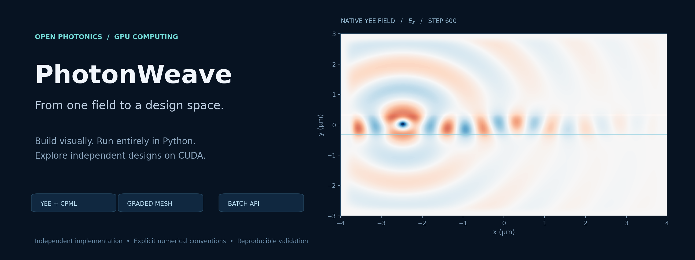

# TorchFDTD

Formerly PhotonWeave. The Python package and command are now `torchfdtd`.
See the [rename and migration notes](docs/TORCHFDTD_RENAME.md). Archived numerical
records retain their original names and source hashes.

An independent, MIT-licensed photonics workbench: visual structure editing in the browser, a shared Python project API, and GPU FDTD on NVIDIA CUDA. The open-source [flaport/fdtd](https://github.com/flaport/fdtd) supplies the grid/backend foundation. TorchFDTD implements Yee derivatives, face-specific convolutional PML, periodic/Bloch wrapping and PyTorch CUDA Graph execution. No commercial solver is needed for the native solver. The optional FSP interoperability bridge requires an installed, licensed Lumerical FDTD.

The interface follows the familiar FDTD workflow: Objects Tree, XY/XZ/YZ and perspective CAD views, object properties, material database, simulation region, Layout/Analysis modes, field visualizer, monitor traces, and Python export. It is not affiliated with Ansys and does not implement the full Lumerical feature set.

This is a **development preview**. The required-workflow checklist remains incomplete. See the [preview release scope](docs/PREVIEW_RELEASE.md), [feature/property checklist](docs/FEATURE_CHECKLIST.md), [parity requirements](docs/PARITY_ROADMAP.md) and [FSP bridge scope](docs/FSP.md). The checklist separates native-engine, Python, UI and independent FSP support. Its counts are property counts, not a product-completion percentage.

**Comparison guide:** **[Lumerical FDTD speed comparison](#primary-speed-comparison-lumerical-fdtd)**, [capabilities and batch support](#capability-comparison), [mixed-grid ensembles](#mixed-meshes-and-durations-in-one-python-batch), [single-case measurements](#measured-cuda-comparisons), [remaining competitiveness work](docs/OPEN_SOURCE_COMPARISON_KO.md#비교우위-개발-프로젝트의-현재-작업). Measured gains below establish a specific forward-workflow advantage against flaport/fdtd, not leadership over every CUDA solver.

[Trainable source waveforms](docs/DIFFERENTIABLE_SOURCES.md) now connect multiple
soft electric/magnetic sources and dielectric parameters to checkpointed Torch
and fused CUDA gradients. Point, online spectrum and six-field plane outputs
are supported with fixed source positions/profiles. The FP32/complex64 CUDA
integration covers nine cases with maximum waveform-gradient relative L2 error
8.55e-7 against full-state CPU autograd. This is an implementation check, not a
physical convergence or performance claim. A [runnable example](examples/differentiable_sources.py)
jointly updates source amplitude/phase and an interior material parameter.

The [real FP32 capacity gate](docs/BEYOND_VRAM_FP32.md) now passes on RTX 5880:
**54 GiB of E/H state**, ten forward/backward steps, **2.23 GB peak Torch CUDA
allocation**, and gradient relative L2 error **9.12e-8** against a causal-cone
oracle. The full timed run took **58.41 minutes** with buffered file backing.
This establishes short-run capacity, not sustained speed or device convergence.

A [metadata-only streamed policy planner](docs/STREAMED_WORK_PLANNING.md) now
compares exact replay work and logical file traffic before allocating material
or field arrays. It checks candidate memory budgets and can select by an explicit
work metric. In a small FP32 CUDA check, depth four reduced logical file I/O by
45.16% versus depth two, with identical histories and a 7.30e-9 gradient difference.
The deeper policy performs more field-update work. This is not a speed ranking.

Streamed reservations now follow measured lifetimes. Distinct live file banks,
counted by identity with cyclic garbage collection disabled, never exceed two in
forward and `checkpoints + 3` in backward, so the disk reservation charges that
bound instead of `checkpoints + 5`. A [host allocation ledger](docs/STREAMED_FDTD.md)
on two RTX 3060 runs found no full-size host tensor in forward and exactly two in
backward, so the measured scope reserves four parameter copies instead of eight.
Injected allocation, read, write, transfer and reduction failures leave no scratch
files while their tracebacks are alive. These are lifetime measurements, not
speed or capacity results, and other physics paths keep the earlier reservations.

Experimental [file-backed spatial execution](docs/validation/STATE_BACKING_REPORT.md)
now extends the streamed adjoint beyond application-owned DRAM field banks.
Supported gradients match the DRAM path exactly in the recorded tests, while
file execution is slower. OS cache memory and sustained NVMe performance remain
unvalidated.

[Periodic density streaming](docs/streamed_density.md) now generates material
slabs directly from a CPU 2D design and reduces gradients back to that design.
Streamed `PeriodicLayerResponse` avoids both global 3D epsilon and epsilon-VJP
arrays. Host, file and asynchronous CUDA numerical checks pass. Its large-grid
throughput is still unmeasured.

The experimental [exact-endpoint PMC API](docs/PMC_IMPLEMENTATION_PLAN.md) now
connects real FP32 CPU/CUDA fields, point-source waveforms and material gradients
through bounded binomial checkpoint replay. Closed PEC/PMC projects also run
through the browser, JSON, CLI and ordinary `Simulation` API, with six-face
editing, point traces and complete endpoint NPZ storage. A separate
uniform PMC+CPML endpoint API includes real FP32 CPU/CUDA propagation and
auxiliary-state, material and waveform adjoints. A small full/half-domain
comparison preserves fields and gradients and halves checkpoint payload.
[Restricted mixed-boundary Project dispatch](docs/PMC_NATIVE_CPML.md) now
connects this path to ordinary Python, CLI and browser execution. It requires
equal uniform spacing, a common PML depth/strength and an explicitly supported
profile. A [homogeneous normal-incidence pulse gate](docs/PMC_CPML_ABSORPTION.md)
passes a 1% reflected-field criterion for two tested PML depths. General
absorption accuracy and throughput remain pending. A separate
[bulk tensor dielectric API](docs/ANISOTROPY_IMPLEMENTATION_PLAN.md) supports
periodic/Bloch CPU/CUDA fields and full symmetric tensor gradients. An
isotropic fixed CPML exterior now encloses interior tensor materials, with
its collar excluded from design gradients. The [native tensor workflow](docs/TENSOR_NATIVE.md)
connects six-component materials to browser editing, Project/CLI execution
and differentiable material tables. General anisotropic absorbing boundaries,
tensor ADE and streamed PMC remain incomplete.
A [rotated tensor slab](docs/TENSOR_CPML_SLAB_ACCEPTANCE.md) in that fixed
isotropic exterior gives 1.0088% and 0.2421% complex transmission errors on two
meshes, with a 1.51% rotation-gradient error on the coarse mesh. This does not
establish general anisotropic PML reflection or long-time stability.
[Opposing mode ports](docs/MODE_NETWORK.md) now assemble complex multimode
S matrices with fixed reference planes and one case graph at a time during
backward. FP32 CUDA checks cover four-channel guide propagation, reciprocity
and an interior material gradient. A subsequent Python extension accepts
different fixed exterior cross-sections, with incident-port-specific calibration
and receiving-port-specific normalization. Its CPU checks and open-boundary
accuracy limits are recorded separately from the earlier CUDA evidence.
Arbitrary branch ports, source/eigenmode gradients and streamed injection remain open. The measured coarse-mesh power defect is reported in
the validation record, rather than interpreted as exact conservation.
[Open transverse CPML ports](docs/OPEN_MODE_PORTS.md) now add confined fixed
waveguide modes, full-plane modal tails, four-channel CUDA propagation and
interior-material S-matrix gradients. An independent vector fiber oracle,
slab roots and padding checks bound the tested mode accuracy. General routing,
mode-profile differentiation and streamed injection remain incomplete.
The [native CAD mode-network workflow](docs/MODE_NETWORK_WORKFLOW.md) now connects
the same Project snapshot to Python and a browser port editor, with complex S
tables, selected interior material derivatives, cancellation and JSON/Python/NPZ/CSV
exports. Its actual open-guide CPU/CUDA workflow check is separate from optical
convergence and comparative performance.
A [fixed-slab physical-gradient check](docs/MODE_NETWORK_GRADIENT_ACCEPTANCE.md)
at 25 nm spacing passes a predeclared 2% derivative criterion and an actual
descent step. It does not establish general shape or CR convergence.

[GDS geometry workflows](docs/GDS.md), [trainable density constraints](docs/DESIGN_PARAMETERIZATION.md)
and [differentiable diffraction/far-field transforms](docs/RADIATION.md) extend
the Python API. A separate [GDS mode-port adapter](docs/GDS_MODE_PORTS.md)
connects explicit full-cell TEXT markers to the opposing-port network and a
caller-sampled native material tensor. The native dipole angular-pattern error decreases from 1.03%
to 0.23% over three FP32 meshes. The [stored-plane diffraction workflow](docs/RADIATION_WORKFLOW.md)
adds browser order tables, matched-reference efficiencies and NPZ/Python
postprocessing without another FDTD run. See the [FDTDX parity completion gates](docs/FDTDX_PARITY_KO.md)
for verified scope and remaining work. This does not establish overall FDTDX
parity or a speed advantage over it.

An opt-in [reversible adjoint](docs/REVERSIBLE_ADJOINT.md) now reconstructs
lossless periodic FP32 fields from one terminal state without checkpoint
replay. The Python API includes memory admission, retained-backward
ownership and drift rejection. CPU and native CUDA full-gradient checks
pass through 512 steps. A separate [recorded-interface CPML API](docs/REVERSIBLE_CPML.md)
supports scalar or componentwise diagonal FP32 designs with fixed absorbing
exterior material, fixed Bloch phases and soft electric plane sources.
Four tangential planes per timestep replace full-volume replay. Boundary history
can use a bounded asynchronous CUDA/pinned-CPU transport. The new
`ReversibleCPMLPlaneSimulation` accumulates all six spectral fields online and
regenerates small backward seed blocks. Its real and complex CUDA plane outputs
match checkpointed spectra, with full material-gradient relative errors below
3.2e-7 in the [recorded fixtures](docs/validation/reversible_cpml_extended_workflow.json).
The explicit recorded policy now connects CPU density tensors to calibrated
two-polarization `PeriodicLayerResponse` and the browser inverse-design panel.
Cases replay one graph at a time. A 160-step oblique CUDA fixture matches
checkpointed responses exactly, with density-gradient relative error 3.00e-7.
[Policy and workflow evidence](docs/validation/recorded_periodic_workflow.json)
separates these discrete checks from physical convergence and performance.
The original real scalar CPU checks extend through 2,048 steps. General physical
combinations, broad long-time acceptance and competitive throughput remain open.

Experimental [resident/streamed adjoint selection](docs/EXECUTION_SELECTION.md)
now compares full-grid and tiled execution with one CPU design-tensor API.
The measured search includes resident input/output transfers and reuses the
bounded gradient-reference cache. Fixed detection planes now use the same
selection, including complex field/flux VJPs, reference normalization and
optional 3D quadrature. The [real CUDA observation transpose](docs/DENSE_ADJOINT_OBSERVERS.md) now uses fixed-size kernel source and an indexed packet for dense planes. A [radius/damping example](examples/differentiable_plane_design.py)
retains the optimizer graph across execution policies. Policy quality at full application duration
remains unverified. A separate [held-out streamed-policy study](docs/validation/MATERIAL_POLICY_REPORT.md#held-out-rtx-5880-real-fp32-policy-comparison)
selected the fastest of six 128-step ADE policies using at most 32 calibration
steps. A separate [causal-halo rerun](docs/validation/MATERIAL_POLICY_REPORT.md#held-out-causal-halo-rerun)
retained that ranking for real FP32 and complex FP64. These studies compare
streamed policies. A subsequent [nine-policy unified study](docs/validation/UNIFIED_POLICY_REPORT.md)
selected the fastest resident policy in both precisions. Calibration did not
repay its cost relative to the already-fastest resident baseline.
A [256-step dense-plane follow-up](docs/validation/PLANE_POLICY_REPORT.md)
also selected the fastest resident policy for real FP32. Complete field and
material VJPs passed. Streaming remains slower for this VRAM-fitting workload.
Large grids can now opt into [byte-budgeted resident adjoints](docs/BUDGETED_RESIDENT.md)
so a grid that fits memory is not forced into streaming by the workbench cell
guard. Short 256-cubed dielectric and 208-cubed ADE forward/VJP checks passed.
They are resident index/capacity checks, not beyond-VRAM speed measurements.
An [allocation-derived CUDA planner](docs/RESIDENT_ALLOCATION_MODEL.md) now
counts native arrays, exact checkpoint states and cold spectral library pools.
The two large-index cases also passed with two device checkpoints under a
4 GiB solver budget. Subsequent 512-cubed dielectric and ADE checks completed
on RTX 5880 with peak Torch CUDA allocations of 15.9 GB and 17.9 GB. These
12-step capacity/gradient checks do not establish long-time convergence or speed superiority.

Experimental [differentiable detector planes](docs/DIFFERENTIABLE_PLANES.md) now connect collocated E/H, signed power and matched-reference normalization to the discrete adjoint. A fixed dielectric slab passes Fresnel, conservation and refractive-index gradient checks. General mode-port workflows and physical convergence of the full CR objective remain pending.

[Parameterized boxes, ellipsoids and cylinders](docs/DIFFERENTIABLE_GEOMETRY.md)
connect dimensions, positions, rotations and permittivities to Torch optimizers.
Geometry backward replays bounded spatial chunks, with FP32 resident and DRAM
FDTD checks. The dense material map remains allocated in this API.
A separate [FP32 physical slab study](docs/gradient_mesh.md) refines both mesh
and geometry transition width against analytic transmission and derivatives.
The followup gives 1.63% thickness-gradient and 1.78% permittivity-gradient
errors, with duration/PML controls and actual improving design steps. The
initial failed criterion is retained. Curved-interface and CR convergence
remain separate requirements.

The optional [streamed geometry API](docs/streamed_geometry.md) produces
material slabs and reduces their VJPs directly to shape parameters, avoiding
both global epsilon and global epsilon-gradient arrays. It supports fixed
plane flux objectives, host/file banks and asynchronous CUDA tiles. Its large
capacity and throughput measurements remain pending.

[PEC and electric antisymmetry](docs/BOUNDARIES.md) now preserve physical mesh
endpoints across CPU/CUDA, adjoint, streaming and batch paths. PMC and magnetic
symmetry now run closed cavities through the native Project, browser and CLI.
The resident `EndpointProject` API retains material and waveform gradients.
The explicit uniform PMC+CPML API supports CPU/CUDA adjoints, and the
[restricted native adapter](docs/PMC_NATIVE_CPML.md) exposes supported mixed
boundaries in Project, CLI and browser execution. ADE, streaming and
tensor-batch integration remain pending.
The experimental [single-domain slab API](docs/DOMAIN_DECOMPOSITION.md) adds
rank-local Yee propagation, halo transposes and checkpointed material gradients.
Its 2/3-rank checks include real Linux Gloo CPU processes, with fields and
initial-state/material gradients matched to the resident solver. Actual
NCCL multi-GPU execution and scaling remain unverified.

[Dispersive material adjoints](docs/DISPERSIVE_ADJOINT.md) connect epsilon-infinity, oscillator strength, resonance and damping to point spectra and fixed plane flux. Resident Torch and optional fused CUDA paths include Drude/Lorentz P/Q states in bounded checkpoint replay. Shared parameters stay compact, and CUDA material gradients use block reductions without atomics. Experimental [spatial ADE streaming](docs/STREAMED_DISPERSIVE.md) adds DRAM/file banks, asynchronous CUDA tiles and compact material-gradient reductions. A [54 GiB complex-FP64 ADE capacity run](docs/validation/DISPERSIVE_CAPACITY_REPORT.md) completed ten forward steps and first-order material gradients on RTX 5880 with 5.17 GB peak Torch CUDA allocation in 54.8 minutes. A separately recorded causal-halo rerun completed with 3.65 GB in 49.6 minutes and matching discrete gradients. This demonstrates short-run capacity beyond physical VRAM. The separate [real-FP32 beyond-VRAM gate](docs/BEYOND_VRAM_FP32.md) has now passed. Sustained performance and physical design-gradient convergence remain unverified.

RTX 5880 resident ADE measurements compare the same forward/objective/backward operation, including checkpoint replay, against our Torch CUDA path. These are warmed internal comparisons. [Full conditions, backward-only ablation, memory and raw records](docs/validation/DISPERSIVE_CUDA_REPORT.md).

| Grid / steps | Fields | Torch CUDA (s) | Fused forward + backward (s) | Speedup |
| --- | --- | ---: | ---: | ---: |
| 32^3 / 64 | Real FP32 | 1.3021 | 0.0806 | 16.15x |
| 32^3 / 64 | Complex FP64 | 1.4252 | 0.0905 | 15.75x |
| 64^3 / 64 | Real FP32 | 1.4026 | 0.1033 | 13.58x |
| 64^3 / 64 | Complex FP64 | 1.2523 | 0.2637 | 4.75x |
| 128^3 / 128 | Real FP32 | 4.2505 | 0.5307 | 8.01x |
| 128^3 / 128 | Complex FP64 | 19.9781 | 4.6447 | 4.30x |

[Fixed Bloch-phase adjoints](docs/BLOCH_ADJOINT.md) support resident Torch CPU/CUDA and complex checkpoint replay, with an oblique TE slab validation. Optional [fused complex forward updates](docs/COMPLEX_CUDA.md) and [fused complex backward](docs/COMPLEX_CUDA_ADJOINT.md) are available. Experimental [complex spatial streaming](docs/STREAMED_FDTD.md#public-complex-streamed-api) supports DRAM/file-backed states, asynchronous CUDA staging and first-order real-epsilon gradients. Full-pupil CR optical convergence and inverse-design validation remain pending.

[Sequential case replay](docs/RECOMPUTED_CASES.md) now supports coupled multi-case inverse-design objectives. An eight-case RTX 5880 experiment reduced peak Torch CUDA allocation by 55%, with a 63% iteration-time increase and matching gradients. This is a memory trade-off, not a speedup or completed CR validation.
A new [shared-budget case API](docs/ADJOINT_BATCH.md) admits all solver, output
and gradient-carrier reservations before executing heterogeneous point/plane
cases. It preserves coupled objectives and shared geometry/material gradients
while retaining one solver graph at a time. Eight 512-cubed dielectric cases
completed on RTX 5880 with a 15.9 GB peak Torch CUDA allocation. After fixing
[cached-memory admission](docs/CUDA_CACHE_ADMISSION.md), fresh dielectric and
ADE eight-case runs both passed, with respective peaks of 15.9 GB and 17.9 GB.
These remain twelve-step capacity/VJP checks. Concurrent adjoint microbatches remain open.
The [matched CPU/DRAM and CUDA adjoint measurements](docs/CPU_GPU_ADJOINT_BENCHMARK.md)
include input/output transfers and complete material VJPs. Each 256-cubed,
128-step FP32 problem uses one warm-up and three interleaved repetitions.

| Material | Fastest tested Torch CPU (s) | Resident CUDA (s) | CPU/CUDA ratio | CUDA + DRAM slabs (s) | CPU/DRAM ratio |
| --- | ---: | ---: | ---: | ---: | ---: |
| Dielectric | 407.689 | 2.283 | 178.55x | 9.435 | 43.21x |
| Two-pole ADE | 742.037 | 4.996 | 148.53x | 23.902 | 31.04x |

These are internal backend comparisons on RTX 5880, within VRAM capacity.
The CPU baseline is this project's Torch implementation. These are not
external-solver or beyond-VRAM speedups.


[Differentiable detector allocation](docs/DETECTOR_ALLOCATION.md) preserves the CR reference's electric-intensity well fractions with independent midpoint quadrature. Synthetic source parity and material-gradient tests pass. Matched CR optical validation remains pending.

[Selected-frequency polarization synthesis](docs/POLARIZATION_SYNTHESIS.md) now passes a 3D oblique x/y slab check for transmission, energy balance and material derivatives. It uses two calibrated source responses and is not yet full-pupil CR validation.

[Equivalent-electron objectives](docs/ELECTRON_OBJECTIVE.md) now connect spectral response, fixed calibration, shot noise and exposure-weighted information. Scores and gradients match the active CR objective using its locked development context. The optical CR simulation itself remains unvalidated.

The first [locked CR seed optical pilot](docs/validation/CR_SEED_OPTICAL_PILOT.md) now compares TORCWA and FDTD at one wavelength/ray. Mesh refinement reduces the discrepancy, but convergence and full-pupil inverse design remain unvalidated. Dense observation gathering was also batched to remove per-sample Python overhead.

The [actual CR density derivative pilot](docs/validation/CR_DENSITY_ADJOINT_PILOT.md) passes one directional finite-difference check on RTX 3060 and RTX 5880, with relative discrepancy 3.06e-6 and peak Torch allocation 332 MB. This validates a discrete one-ray test objective, not the full CR information optimization.

[Spectral/pupil objective assembly](docs/SPECTRAL_PUPIL_RESPONSE.md) now connects explicit wavelength/ray cases to electron information with bounded case replay and unnormalized illumination weights. Full CR optical validation remains in progress.

[Budgeted periodic density responses](docs/PERIODIC_HIERARCHICAL_DESIGN.md)
now connect the same two-polarization detector objective to resident, DRAM or
file-backed execution, with one source-basis solver graph at a time. The CR
runner exposes these policies and preflights its complete case schedule.
Small response/gradient checks pass. Full-application validation of this new
integration remains separate from the legacy-path optical measurements.
The [restartable CR design driver](docs/CR_INVERSE_DESIGN.md) adds projected
Adam updates, atomic density/moment checkpoints and a complete final forward
evaluation. The original CR application's physical optimization remains pending.
`PeriodicLayerResponse.auto(...)` now selects resident, DRAM or explicitly
configured file execution from shared memory budgets without calibration
solves. It shrinks tiles when needed and keeps the chosen policy for backward.
This capacity heuristic does not claim the fastest policy.
The [Inverse design panel](docs/PERIODIC_DESIGN_UI.md) now edits periodic density,
checks memory, runs Adam through the same Torch API, and exports setup, Python
and evaluated results. It uses the ordinary shared simulation queue.
An opt-in `PeriodicResponseCache` also reuses exact responses and seeded
density gradients when the same physical design recurs. It retains bounded
CPU tensors, without field histories. Full optimizer speedup is unmeasured.
The CR evaluator and optimizer now default to one FP32 path for density,
fields, information, gradients and Adam moments. `PeriodicLayerResponse` also
defaults to FP32. FP64 remains an explicit validation option. See the
[precision scope and checks](docs/validation/FP32_PRECISION.md).
The full 144-case FP32 CR response and density-gradient comparison now passes
against the archived FP64 reference. Physical convergence and completed
original-protocol optimization remain pending.
A [measured observation-setup improvement](docs/validation/PERIODIC_OBSERVATION_SETUP.md)
removes repeated mesh-count derivation. On a synthetic periodic RTX 3060 case,
full response/objective/VJP medians improve by 1.52x at 128 steps and 1.04x at
1,600 steps, with bitwise-identical responses and density gradients.

The completed [144-case spatial refinement](docs/validation/CR_SPATIAL_REFINEMENT.md)
reduced the response discrepancy relative to the recorded TORCWA order-16
reference from 4.85% to 0.888% in relative L2 when mesh spacing changed from
50 to 25 nm at matched duration and PML thickness. This is a convergence trend,
not a physical-gradient or optimized-design certificate.

[Bounded CPU reference caching](docs/SPECTRAL_PUPIL_RESPONSE.md#bounded-cpu-reference-reuse) can reuse homogeneous spectral planes across case replay without retaining full field histories. It preserves tested responses and density gradients. No cache speedup is claimed yet.

On one relaxed CR seed ray at 540 nm, [fused complex forward execution](docs/COMPLEX_CUDA.md#selected-cr-layer-measurement-on-rtx-3060) reduced the complete FP64 forward API median from **31.45 s to 8.39 s (3.75x)** on RTX 3060, with a 5.55e-17 response difference. This compares our two backends at the same fixed settings, not competing solvers or complete inverse-design iterations.

Replay now releases recursive closure references after backward, so completed resident and streamed solver buffers do not wait for cyclic garbage collection after their result graphs are released. [Lifetime checks](docs/COMPLEX_CUDA_ADJOINT.md#replay-lifetime) cover CPU, CUDA and file-backed tile execution.

With the same fused forward, [fused complex backward](docs/COMPLEX_CUDA_ADJOINT.md#selected-cr-objective-and-gradient-measurement) reduced a complete selected-CR objective/VJP call from **50.20 s to 32.40 s (1.55x)** on RTX 3060. Peak Torch allocation was **360 MB vs 328 MB**, with a maximum density-gradient difference of 2.17e-19. This is a separate matched-backend measurement, not a full-pupil or competitor comparison.

<!-- BEGIN LUMERICAL TIMING COMPARISON -->
## Primary speed comparison: Lumerical FDTD

**Historical measurements, not a validated current-release speedup.** The primary comparison target is Lumerical FDTD. The available paired records below compare its **CPU engine configured for one process and 16 threads** with earlier TorchFDTD GPU builds on the **RTX 5880 Ada** workstation. Each value is the median of three recorded runs. These rows do not establish equal optical accuracy or performance against Lumerical GPU execution.

### Recorded run wall time

| Historical case | Lumerical CPU, 16 threads (s) | TorchFDTD RTX 5880 (s) | Lumerical CPU / TorchFDTD GPU |
|---|---:|---:|---:|
| Sphere, earlier build, 64³ / 1,000 steps | 3.997 | 0.613 | **6.52×** |
| Sphere, earlier build, 128³ / 2,000 steps | 30.736 | 3.119 | **9.85×** |
| Sphere, later CPML revision, 128³ / 2,000 steps | 30.233 | 1.990 | **15.19×** |

Run wall time includes Lumerical meshing, engine launch and file I/O. TorchFDTD timing includes allocation, graph preparation, stepping and final host transfer, excluding optional NPZ compression. These are differently scoped workflow timers. The ratio is Lumerical time divided by TorchFDTD time.

### Recorded engine and stepping time

| Historical case | Lumerical logged FDTD time (s) | TorchFDTD stepping time (s) | Lumerical CPU / TorchFDTD GPU |
|---|---:|---:|---:|
| Sphere, earlier build, 64³ / 1,000 steps | 1.897 | 0.561 | 3.38× |
| Sphere, earlier build, 128³ / 2,000 steps | 28.186 | 3.027 | 9.31× |
| Sphere, later CPML revision, 128³ / 2,000 steps | 28.288 | 1.924 | 14.71× |

The fixture is an index-2 sphere of radius 0.6 µm in air, in a 6 × 6 × 6 µm computational domain, with a 1.55 µm Gaussian dipole excitation and one point monitor. Total cell counts and actual time steps were checked in the original paired runs. Native precision was float32. The archived Lumerical API version string is `8.31.3633` from the v241 installation. Its numerical precision, exact CPU model, explicit warmup policy and source hashes for those earlier native builds are not established by these records.

**Accuracy qualification:** dipole normalization, field staggering/interpolation and absorbing boundaries differ. The historical optical traces were not equivalent. These timing ratios must not be presented as same-accuracy speedups or multiplied by later native optimization gains. The two 128³ rows are successive development measurements of the same fixture, not two different workloads.

| Primary comparison still required | Status |
|---|---|
| Current TorchFDTD vs Lumerical CPU, common accuracy target | Pending new matched validation |
| Current TorchFDTD vs Lumerical GPU on the same RTX 5880 | Not measured |
| Multi-structure batch / inverse-design throughput vs Lumerical | Not measured |

Only aggregate timing facts are included here. No commercial field arrays, spectra, screenshots, project files or engine logs are redistributed with this table. The governing licence remains unknown, and this local draft is **not cleared for public release**. [Publication conditions](docs/RELEASE_REVIEW.md#timing-table-exception-and-publication-status). The reproducible open-source comparisons below are secondary benchmarks.
<!-- END LUMERICAL TIMING COMPARISON -->

## Capability comparison

Reviewed external public source on 19 September 2026. TorchFDTD implementation status updated on 20 September 2026. A feature distinction is not a measured speed advantage. Unknown or unmeasured batch behavior is not marked unsupported.

| Project | GPU/backend | Independent ensemble / same-GPU batch | Adjoint/autodiff | Relevant scope | RTX 5880 comparison |
|---|---|---|---|---|---|
| **TorchFDTD** | PyTorch + native CUDA, Windows tested | Process jobs with resume and device assignment. **Shared CUDA E/H/source/trace launches**, cohort splitting, exact mixed-topology grouping and measured size selection. DE population evaluation | **Partial**. Dielectric/Bloch/CPML/ADE/PEC discrete adjoints, analytic geometry and density, fixed-plane/mode/radiation objectives and hierarchical replay. Fixed-profile soft-source waveform VJPs are supported. Eigenmode/source-position derivatives remain limited | Browser + Python CAD, independent FSP subset, GDS geometry, multipole ADE, rectilinear/graded mesh, selective plane DFT | Single-case, ensemble, design-loop, native mesh and preparation ablations below |
| [FDTDX](https://github.com/ymahlau/fdtdx) | **JAX currently**, CUDA/ROCm installation paths | JAX composition. Same-GPU cohort throughput not measured here | Reversible/checkpointed with restrictions. ADE uses checkpointing, reference eigenmodes are held fixed | Dispersive/anisotropic materials and rectilinear grids | Matched Linux GPU correctness below. Comparative throughput pending |
| [fdtdz](https://github.com/spinsphotonics/fdtdz) | JAX wrapper + specialized CUDA | README proposes distributing independent jobs through JAX. Fused batch-axis throughput not verified | Reviewed primitive has no registered JVP/VJP/transpose rule | Fast specialized dielectric scope, constrained z size, x/y adiabatic absorption, z PML. TorchFDTD adds dispersion, graded grids and online plane DFT | Not measured, compatible package setup pending |
| [flaport/fdtd](https://github.com/flaport/fdtd) | NumPy / PyTorch CUDA | Public `Grid` represents one case. Our external graph adapter runs its updates. Dedicated upstream cohort API not verified | Default backend disables gradients, so default autodiff is not established | Readable grid foundation used and attributed by TorchFDTD | PyPI 0.2.2 measured, including eager and graph-adapted baselines |
| [fdtd3d](https://github.com/zer011b/fdtd3d) | C++ / CUDA / MPI | **Single-problem domain decomposition** differs from independent-case batches. Cohort throughput not verified | Not documented in reviewed README | Compiled solver and distributed execution. Single-grid MPI is still missing from TorchFDTD | Not measured, compatible compiler/runtime environment pending |

FDTDX provides single-problem sharding and broader anisotropic material
workflows. TorchFDTD's bulk tensor API supports nondispersive periodic/Bloch
domains and a fixed isotropic CPML exterior. We have not demonstrated a speed advantage against
FDTDX, fdtdz or fdtd3d. [Pinned sources and limitations](docs/OPEN_SOURCE_COMPARISON_KO.md).

A first [matched FDTDX correctness gate](docs/FDTDX_MATCHED_CORRECTNESS.md)
uses the same Linux RTX 3060, a 16³ periodic dielectric grid, 64 FP32 steps,
one fixed point source, two raw Ex histories and four requested checkpoints.
TorchFDTD uses the frozen `6fa0c35` wheel and FDTDX uses `60c1c27`.

| Matched quantity | TorchFDTD | FDTDX | Difference |
|---|---:|---:|---:|
| Loss | 0.0001640023838263 | 0.0001640023838263 | 0 |
| Slab-permittivity derivative | −7.2264010669e−5 | −7.2264010669e−5 | 0 |
| Two complete Ex histories | 64 × 2 samples | 64 × 2 samples | Max absolute error 0 |
| Comparative speed / memory | Pending | Pending | No ranking |

The small fixture establishes the comparison contract. It does not establish
large-domain capacity, all-physics equivalence or a performance advantage.
The independent Fourier check, finite differences, precision conventions,
artifact hashes and setup corrections are retained in the linked record.

A subsequent [64³, 512-step full-gradient gate](docs/FDTDX_MATCHED_FULL_GRADIENT.md)
uses the same frozen implementations and compares all 262,144 epsilon-gradient
entries, including the fixed source cell's zero cotangent. The histories remain
identical. Gradient relative L2 difference is **1.06e-6**, and maximum absolute
difference is **8.38e-13**. Independent slab and signed-direction finite
differences also pass. This extends the derivative comparison, not the speed
ranking. Ambient desktop activity prevented the primary quiet timing criterion.

| Required workflow | TorchFDTD implementation milestone | Still needed for broader FDTDX parity |
|---|---|---|
| GDS | Explicit layer stack, hierarchy/units/PATH conversion, limited export and explicit full-cell opposing mode ports | General holes, narrow/branch ports and automatic port mapping |
| Design parameters | Density filters, fixed masks, exact symmetry, projection/continuation and optimizer resume | General shape derivatives and fabrication guarantees |
| Mode ports | Fixed-mode CUDA launch, opposing-port multimode S matrices and interior material VJPs, plus open bound modes, unequal fixed sections and native CAD/Python/browser workflows | Arbitrary branch/leaky ports, streamed injection, modal source parameters and broader physical convergence. Eigenmode differentiation is a separate research extension |
| Radiation | Differentiable Bloch orders, closed-box homogeneous far fields, native FP32 mesh convergence, stored-plane browser/NPZ diffraction and six-face closed-box UI | Layered/periodic-lattice far fields and broader physical convergence |
| Boundaries / tensors / multi-GPU | PEC, native closed-PMC and restricted PMC+CPML GUI/CLI/API, endpoint CPU/CUDA adjoints, tensor adjoints with fixed isotropic CPML exterior | General PML profiles/absorption, streaming combinations and verified single-problem multi-GPU |

The [complete row-by-row parity gates](docs/FDTDX_PARITY_KO.md) retain failed,
partial and unmeasured conditions instead of treating API presence as full parity.

**Current development, 0.14:** closed normal-incidence [TFSF boxes](docs/TFSF_SOURCES.md) separate incident and scattered fields around isolated structures. Python, UI previews, CPU/CUDA and shared CUDA batches use a live incident Yee line and sparse face corrections. Independent discrete references and analytic Mie sphere comparisons are recorded, including non-monotonic mesh errors. A 3D FSP source subset is mapped, while oblique incidence and general FSP compatibility remain open. Version 0.13 added [one-way periodic-cell planes](docs/ONEWAY_SOURCES.md), while 0.12 added [electric/magnetic vector sources](docs/DIPOLE_SOURCES.md). Python controls fixed-duration ensembles, objectives and native field results through [`run_tensor_batch`](docs/TENSOR_BATCH.md). Automatic decay termination, full-domain divergence checks, coupled passive multipole materials and matched-reference mesh studies remain available in single/process runs. See the [ordered implementation priorities](docs/IMPLEMENTATION_PRIORITIES.md).

Six-component frequency planes, reference-normalized flux, global/custom monitor frequencies, independent process batches and black-box inverse design are also available. Read the [Python and batch guide](docs/PYTHON_BATCH.md), run the [slab example](examples/flux_slab.py) or [design example](examples/inverse_design.py), and see the [technical manuscript by Hyoseok Park](docs/paper/torchfdtd-manuscript.pdf) ([LaTeX source](docs/paper/manuscript.tex), [build and Overleaf guide](docs/paper/README.md)). The manuscript is a draft, not a peer-reviewed publication.

**Spectral batch development:** selectable shared CUDA plane interpolation and DFT accumulation now cover single runs and independent cohorts. Set `region.cuda_monitor_kernel="fused"`, or use **Frequency monitor kernel** in the FDTD panel. The new tables separate monitor improvements, cohort scheduling and an external baseline given the same fused observation adapter. [Complete Python example](examples/spectral_batch.py), [algorithm and limits](docs/CUDA_SPECTRA.md).

**Measured-material fitting:** import your optical samples through Python or Materials, fit passive Drude/Lorentz poles, inspect measured/fitted n/k and continuous/FDTD errors, then retain the data and coefficients in your project. Unmet tolerances stay explicit. [Workflow, algorithm and limits](docs/MATERIAL_FITTING.md), [Python example](examples/material_fitting.py). The main development priorities are Torch differentiable design and hierarchical memory execution, with interface accuracy and normalized mode/port objectives as required validation, as recorded in the [priority plan](docs/IMPLEMENTATION_PRIORITIES.md).

**Torch differentiation and memory:** experimental adjoint APIs connect diagonal epsilon, fixed real/Bloch boundaries and selected Torch geometry maps to point signals, spectra and fixed detection planes, `loss.backward()` and Adam. Native CUDA forward and backward use a discrete Yee/CPML adjoint with bounded replay checkpoints and optional asynchronous host/disk staging. The [resident dispersive API](docs/DISPERSIVE_ADJOINT.md) also differentiates explicit Drude/Lorentz parameters using Torch or fused CUDA updates. [`StreamedSimulation`](docs/STREAMED_FDTD.md) keeps nondispersive global state in DRAM or files and transposes space-time slab dependencies, with reusable packets and optional asynchronous transfers. [Material-aware tuning](docs/STREAMED_POLICY.md) selects dielectric or ADE policies using two measured durations, bounded gradient-reference memory and budget-fitted default tile/checkpoint proposals. A [54 GiB complex-FP64 E/H forward/backward run](docs/BEYOND_VRAM_VALIDATION.md) exceeded physical VRAM for ten steps. The [real-FP32 capacity gate](docs/BEYOND_VRAM_FP32.md) has now passed. Useful-duration large applications, a unified memory policy, all-physics differentiation and general port-normalized design remain pending. [API and limits](docs/DIFFERENTIABLE_FDTD.md), [complete example](examples/differentiable_design.py), [measured development results](docs/validation/ADJOINT_REPORT.md), [hierarchy plan](docs/HIERARCHICAL_EXECUTION.md).

**Interface accuracy in progress:** Python and the UI now select an [experimental dielectric subpixel operator](docs/SUBPIXEL_INTERFACES.md), including fused CUDA and independent tensor cohorts. The [complete sphere study](docs/validation/SUBPIXEL_REPORT.md) records both improvements and regressions against an analytic solution. High-index device accuracy, dispersive mixtures and nonuniform subpixel remain open. Staircase stays the default, and no general accuracy or equal-error speed advantage is claimed.

**Analytic CAD follow-up:** polygon extrusion, ellipsoids, elliptical cylinders/ring sectors and ordered three-axis rotations now share Python, UI and CUDA batch paths. Bounded material preparation reduces native batch full wall by **1.44–21.19×** in eight compact-solid workloads. [Measured ablation](#analytic-cad-and-material-preparation-ablation), [geometry conventions and example](docs/ANALYTIC_GEOMETRY.md).

**Rectilinear follow-up:** independent dx/dy/dz and explicit node arrays are available in Python and the UI, with rectangular CFL, physical PML depth and shared CUDA batches. Eight transverse-invariant layer ensembles show **4.33–13.39×** lower native batch wall time after removing unnecessary transverse cells at the same actual time step. [Matched-observable table](#rectilinear-mesh-and-batch-ablation), [controls and limits](docs/RECTILINEAR_MESH.md). This is a native mesh ablation, not an additional cross-library speedup.

**Selective-output follow-up:** selective plane outputs accumulate only the required E/H channels. Eight RTX 5880 ensembles show **1.14–1.69×** lower full-wall cost when requesting the same signed flux instead of storing every field. [Measured timing and memory tables](#selective-output-cuda-ensembles), [runnable Python example](examples/selective_spectra.py). Optional complex128 DFT, per-axis/time strides, Lobatto sampling and independent local apodization are exposed in Python and UI. The [phase/graph study](#current-spectral-throughput-and-optimization-ablations) retains earlier gains and regressions with its original source hashes.

**Ensemble follow-up:** `tune_tensor_batch()` measures cohort sizes with output-equivalence checks and reports the full selection cost. `optimize(execution="tensor")` evaluates differential-evolution populations through shared CUDA launches. The tables below include four 16-case workloads, complete design loops and timing-selection regressions. [Executable Python example](examples/tuned_inverse_design.py).

**Experimental fused CUDA:** select `Region(backend="cuda", cuda_kernel="fused")`, or the **CUDA kernel** control in the UI, after installing `pip install -e ".[cuda-kernels]"`. The earlier native 64³/96³/128³ tests show **3.67–5.76×** full-wall improvement over our PyTorch reference path with bitwise E/H/traces. The cross-library and batch measurements below use their own stated baselines. Current fixed-Bloch forward and first-order real-epsilon adjoints have separate [support limits and validation](docs/COMPLEX_CUDA_ADJOINT.md). [Development milestones](docs/OPEN_SOURCE_COMPARISON_KO.md).

**Measured RTX 5880 ensemble:** four native 64³ sphere cases at 800 steps take 47.04 s with one NumPy CPU worker and 1.175 s with one CUDA worker, approximately 40.0x faster. This is the full batch wall time after warm-up, including setup, transfers and IPC. Two/four concurrent GPU workers take 1.182/1.204 s and do not improve this case. This is not a commercial CPU solver comparison. [Reproduction and raw measurements](docs/validation/BATCH_REPORT.md).

**Distribution status:** public GitHub publication is pending the requested completion and licence review. In particular, independent implementation alone does not resolve applicable commercial licence restrictions or every interoperability issue. [Review record and outstanding conditions](docs/RELEASE_REVIEW.md).

**Native differentiable CPU comparison:** the following full forward/objective/backward timings use an i7-12700 with eight Torch threads and RTX 3060, complex FP64, two checkpoints, one warmup and three alternating repetitions. Every repetition checks signals and gradients. CPU thread tuning is incomplete.

| Grid / steps | CPU + DRAM | GPU resident | GPU + DRAM streaming | CPU / streamed time |
|---|---:|---:|---:|---:|
| 64 × 32 × 32 / 24 | 1.587 s | 0.088 s | 0.737 s | 2.15× |
| 128 × 64 × 64 / 32 | 26.144 s | 0.381 s | 2.104 s | 12.43× |

These problems fit in VRAM. The ratios describe our Torch CPU implementation and do not establish performance against an external CPU/MPI solver, on RTX 5880, or beyond 48 GB. [Conditions, variability and raw records](docs/validation/CPU_DRAM_COMPARISON.md). The separate [physical-VRAM-overflow test](docs/BEYOND_VRAM_VALIDATION.md) completed forward and first-order gradient validation on 603,979,776 cells with 54 GiB of E/H fields, using 7.09 GB peak Torch CUDA allocation. Its 52-minute, ten-step run demonstrates capacity, not speed superiority.

On the **RTX 5880 / Xeon w3-2435 workstation**, a separate real-FP32
128 x 64 x 64, 32-step forward/backward comparison gave:

| Execution | Median iteration | Speedup over native CPU |
| --- | ---: | ---: |
| CPU + DRAM, 8 threads | 1.955 s | 1.00x |
| Resident GPU | 0.04189 s | 46.68x |
| GPU + DRAM, synchronous tiles | 0.4612 s | 4.24x |
| GPU + DRAM, asynchronous tiles | 0.3896 s | 5.02x |

Eight threads was fastest among 1, 4, 8 and 16 tested CPU threads. All modes
passed signal/gradient checks, with three timed repetitions after warmup.
This short problem fits in VRAM. It does not measure beyond-48-GB speed or
external solver performance. Async buffering uses more GPU memory than
synchronous streaming in this case. [Full conditions and every thread-count
record](docs/validation/CPU_DRAM_COMPARISON.md#completed-rtx-5880-real-fp32-comparison).

The same short grid with **complex FP64 / fixed Bloch phase** gave 7.899 s
for CPU + DRAM, 0.09191 s for resident GPU (**85.94x**) and 0.7736 s for
asynchronous GPU + DRAM (**10.21x**). Sixteen CPU threads was fastest in that
sweep, only 1.65% ahead of eight. All repetitions passed signal/gradient checks.
These are native implementation comparisons, not external-solver or large
out-of-core speed claims. [Complete thread sweep and raw timings](docs/validation/CPU_DRAM_COMPARISON.md#completed-rtx-5880-complex-fp64-comparison).

An [independent FSP record reader](docs/FSP_BINARY.md) decodes recognized layout records without a vendor runtime. [Native import and scene writeback](docs/FSP_NATIVE.md) now include boxes, rotated ellipsoids/cylinders, partial elliptical rings and simple polygon extrusions with their stored pivots. Python, CLI and **FSP → GPU → Export current scene** update existing objects while preserving unedited bytes. Variable-length names and vertex lists are supported. Export reparses and checks the resulting geometry and material assignments before returning a file. [Uniform mesh edits](docs/FSP_MESH_WRITE.md) can update axis spacing, total spans, CAD/PML bounds, saved nodes and effective CFL together. Supported source bands/phases, monitor spectra/windows, duration and PML/Periodic settings can also be written. Interface-sampling and automatic-sampling limits are disclosed in the report. [Primitive list editing](docs/FSP_OBJECTS_WRITE.md) adds, removes, duplicates and reorders five primitive families with explicit ID and retained-byte maps. New records use authored drawing defaults. [Source and monitor list editing](docs/FSP_INSTRUMENTS_WRITE.md) adds electric dipoles, mapped 3D planes/TFSF, point traces and frequency planes. Shared monitor components can be separated while retaining their output order. External acceptance of new records/remeshing, groups, graded/explicit mesh-generator export, result-bearing files and general FSP compatibility remain open.

Version 0.5 adds [custom time signals and global source settings](docs/SOURCES.md), CSV/JSON signal editing and mesh-time waveform/spectrum previews. Version 0.6 adds [automatic wavelength/frequency ranges, chirped pulses and endpoint tapering](docs/BROADBAND.md), including independent FSP mapping. DC removal and advanced spatial source types remain unsupported.

<!-- BEGIN GROUPED MEASUREMENTS -->
## Mixed meshes and durations in one Python batch

**RTX 5880 Ada, 16 cases per row, float32, median of 3 warmed repetitions.** Every row interleaves vacuum, sphere, slab and waveguide cases across two meshes or durations. Three planes retain all six complex field components at nine frequencies, plus complete final E/H, point traces and native snapshots.

`run_grouped_batch()` automatically groups exact compatible cases and restores input result order. The four-case cohort cap is fixed before measurement. Full wall includes grouping, setup, graph capture, stepping and output transfer. No grid padding, precision reduction, decimation or shortened run is used.

| Mixed conditions | flaport sequence (s) | Native sequence (s) | Native grouped (s) | vs flaport sequence | vs native sequence | Grouped cases/s |
|---|---:|---:|---:|---:|---:|---:|
| 32³ + 48³, 800 steps | 6.958 | 0.649 | 0.455 | 15.30× | 1.43× | 35.18 |
| 32³ + 64³, 800 steps | 7.892 | 0.722 | 0.578 | 13.66× | 1.25× | 27.70 |
| 32³, 400 + 800 steps | 5.827 | 0.522 | 0.348 | 16.76× | 1.50× | 46.00 |
| 64³, 400 + 800 steps | 6.337 | 0.891 | 0.852 | 7.44× | 1.05× | 18.78 |

The external baseline is **flaport/fdtd 0.2.2 with CUDA Graph and the same fused DFT observer**. It calls unchanged upstream E/H updates. Both one-step and eight-step graphs are measured, and the table uses the lower median. This compares ensemble workflows against an external sequence, not an independently optimized upstream batch implementation.

**All 48 timed-ensemble gates pass.** Native complete outputs agree bitwise with independent native runs. Maximum external point-trace and complex-plane DFT relative L2 differences are **0.3233%** and **0.3875%**, respectively, below the predeclared 1% gates. External final E/H differences remain in the raw record without an equivalence claim.

| Mixed conditions | Grouping and preflight (ms) | Torch peak allocated, sequential / grouped (MiB) |
|---|---:|---:|
| 32³ + 48³, 800 steps | 38.8 | 8.00 / 31.98 |
| 32³ + 64³, 800 steps | 39.0 | 17.92 / 71.63 |
| 32³, 400 + 800 steps | 38.2 | 2.66 / 10.61 |
| 64³, 400 + 800 steps | 39.5 | 17.92 / 71.63 |

The speedup uses existing fused cohort kernels. The new capability schedules heterogeneous inputs automatically. Groups execute successively on one GPU and objective callbacks follow cohort order. Complex fields, automatic per-case termination, grouped optimizer routing and GUI ensemble submission remain open. Cold interpreter/context/compiler, checks and disk I/O are excluded. Torch memory excludes external graph, driver and context allocations. Three repetitions do not establish confidence intervals. **FDTDX, fdtdz and fdtd3d remain unmeasured on this GPU.**

[Python API and semantics](docs/GROUPED_BATCH.md), [standalone example](examples/grouped_batch.py), [all inputs, repetitions, errors and source hashes](docs/validation/grouped-ensembles.json).
<!-- END GROUPED MEASUREMENTS -->

<!-- BEGIN GEOMETRY MEASUREMENTS -->
## Analytic CAD and material-preparation ablation

**RTX 5880 Ada, four independent scenes per row, eight solids per scene, 800 float32 steps, median of three warmed repetitions.**

Native CAD now includes extruded concave polygons, ellipsoids, elliptical cylinders/ring sectors and ordered three-axis rotations. The new preparation path tests membership only inside conservative solid bounds. The baseline tests the same analytic equations over the whole domain. Both use identical Yee grids, sources, CPML, CUDA kernels, cohort sizes and complete outputs. This is a native implementation ablation, not a comparison with another library.

| Solids | Grid | Unpruned batch (s) | Bounded batch (s) | Full-wall gain | Host material preparation, before → after (s) |
|---|---:|---:|---:|---:|---:|
| Spheres | 64³ | 0.242 | 0.161 | 1.50× | 0.091 → 0.013 |
| Rotated boxes | 64³ | 0.608 | 0.185 | 3.28× | 0.437 → 0.018 |
| Concave polygons | 64³ | 3.965 | 0.194 | 20.40× | 3.590 → 0.031 |
| Elliptical ring sectors | 64³ | 2.015 | 0.191 | 10.54× | 1.681 → 0.022 |
| Spheres | 96³ | 0.888 | 0.617 | 1.44× | 0.301 → 0.029 |
| Rotated boxes | 96³ | 2.023 | 0.623 | 3.25× | 1.438 → 0.034 |
| Concave polygons | 96³ | 13.768 | 0.650 | 21.19× | 12.843 → 0.053 |
| Elliptical ring sectors | 96³ | 6.414 | 0.628 | 10.21× | 5.578 → 0.044 |

**All 48 timed-ensemble gates pass bitwise** for permittivity, complete final E/H, point traces, time arrays, snapshots, complex plane fields and signed flux. Display tessellation does not enter the material equations. Independent tests also compare analytic volumes and equivalent box/polygon optical representations.

Full wall includes host preparation, CUDA Graph capture, stepping and output transfer. Cold compilation/context, checks and disk writes are excluded. The GPU still updates every Yee cell. These gains primarily remove host preparation work for compact solids and do not establish a faster CUDA update kernel. Unchanged kernels also show different loop timings in some repetitions, so loop fluctuations are retained in the raw record without attributing them to a new kernel. Longer propagation runs or large overlapping solids may benefit less. No geometry-result cache is used in either mode. Three repetitions do not establish confidence intervals.

[Geometry controls and conventions](docs/ANALYTIC_GEOMETRY.md), [Python batch example](examples/analytic_solids.py), [inputs, repetitions and source hashes](docs/validation/geometry-ensembles.json).
<!-- END GEOMETRY MEASUREMENTS -->

<!-- BEGIN RECTILINEAR MEASUREMENTS -->
## Rectilinear mesh and batch ablation

**NVIDIA RTX 5880 Ada Generation, 4 independent cases per row, 800 float32 steps, median of 3 warmed repetitions.**

The native solver now supports independent axis spacing and explicit rectilinear node arrays. This experiment retains the same physical domain, propagation step, actual time step, sources, PML, duration and 17 flux frequencies. Transverse spacing changes from 0.05 to 0.2 µm, removing 93.75% of cells. The geometries and normal-incidence excitation are uniform in both transverse directions. This is a native mesh ablation, separate from the cross-library tables below.

| Workload | Uniform → rectangular grid | Uniform batch (s) | Rectangular batch (s) | Mesh gain | Batch gain at rectangular mesh | Torch peak allocated, uniform → rectangular (MiB) |
|---|---|---:|---:|---:|---:|---:|
| Vacuum | 128 × 64 × 64 → 128 × 16 × 16 | 0.312 | 0.060 | 5.18× | 1.80× | 120.71 → 7.63 |
| Slab | 128 × 64 × 64 → 128 × 16 × 16 | 0.326 | 0.075 | 4.33× | 1.62× | 120.71 → 7.63 |
| Bilayer | 128 × 64 × 64 → 128 × 16 × 16 | 0.326 | 0.075 | 4.34× | 1.54× | 120.71 → 7.63 |
| Multilayer | 128 × 64 × 64 → 128 × 16 × 16 | 0.336 | 0.069 | 4.88× | 1.70× | 120.71 → 7.63 |
| Vacuum | 192 × 96 × 96 → 192 × 24 × 24 | 1.175 | 0.088 | 13.39× | 1.48× | 386.24 → 24.23 |
| Slab | 192 × 96 × 96 → 192 × 24 × 24 | 1.199 | 0.099 | 12.09× | 1.41× | 386.24 → 24.23 |
| Bilayer | 192 × 96 × 96 → 192 × 24 × 24 | 1.203 | 0.095 | 12.67× | 1.42× | 386.24 → 24.23 |
| Multilayer | 192 × 96 × 96 → 192 × 24 × 24 | 1.255 | 0.094 | 13.37× | 1.46× | 386.24 → 24.23 |

**All 72 timed-ensemble gates pass.** Maximum relative L2 across centerline final E/H, full point traces and signed flux is **5.95e-15** (gate: 3e-5). Every final E/H array is constant along the transverse directions in this experiment. Different grids contain different sample counts. This does not establish a curved-geometry accuracy improvement, a resolution-independent speedup, or superiority over another library.

Full wall includes preparation, graph capture, and final fields/monitor transfer. Cold compilation/context, validation and disk writes are excluded. Memory is the Torch allocator peak, excluding external context, driver and graph allocations. Three repetitions do not establish confidence intervals.

[Python and UI controls](docs/RECTILINEAR_MESH.md), [example](examples/rectilinear_mesh.py), [inputs, repetitions, errors and source hashes](docs/validation/rectilinear-ensembles.json).
<!-- END RECTILINEAR MEASUREMENTS -->

<!-- BEGIN SELECTIVE MONITOR MEASUREMENTS -->
## Selective-output CUDA ensembles

**NVIDIA RTX 5880 Ada Generation, 8 cases per row, 800 float32 steps, three planes with 65 frequencies, cohorts of 4, 3 measured repetitions after warmup.** Full wall includes setup, graph capture, final E/H, point traces and selected results. Cold compilation/context and disk writes are excluded.

When the requested observable is signed flux, the new output selector accumulates **four tangential E/H components instead of six**, and omits unused field/Poynting exports. The same flux frequencies, quadrature and time samples are retained. The full-output column is the native batch with all six fields and three Poynting components stored. The external flaport/fdtd 0.2.2 sequence also receives the **same selective fused observer**, using the lower median of its one-step/eight-step graph options. Native graphs use one step.

| Workload | Grid | flaport sequence (s) | Native full-output batch (s) | Native flux-only batch (s) | Output-selection gain | vs flaport sequence |
|---|---:|---:|---:|---:|---:|---:|
| Vacuum | 32³ | 3.404 | 0.241 | 0.211 | 1.14× | 16.11× |
| Sphere | 32³ | 3.381 | 0.220 | 0.175 | 1.26× | 19.32× |
| Slab | 32³ | 3.324 | 0.239 | 0.194 | 1.23× | 17.14× |
| Waveguide | 32³ | 3.475 | 0.244 | 0.213 | 1.14× | 16.30× |
| Vacuum | 64³ | 4.388 | 0.833 | 0.492 | 1.69× | 8.91× |
| Sphere | 64³ | 4.298 | 0.882 | 0.541 | 1.63× | 7.95× |
| Slab | 64³ | 4.208 | 0.847 | 0.544 | 1.56× | 7.74× |
| Waveguide | 64³ | 4.204 | 0.889 | 0.533 | 1.67× | 7.89× |

Cohort scheduling and memory are separate from output selection:

| Workload | Grid | Flux-only native sequential (s) | Flux-only batch gain | Batch cases/s | Torch peak allocated, full / flux-only (MiB) |
|---|---:|---:|---:|---:|---:|
| Vacuum | 32³ | 0.304 | 1.44× | 37.86 | 18.51 / 14.88 |
| Sphere | 32³ | 0.280 | 1.60× | 45.70 | 18.51 / 14.88 |
| Slab | 32³ | 0.283 | 1.46× | 41.24 | 18.51 / 14.88 |
| Waveguide | 32³ | 0.309 | 1.45× | 37.54 | 18.51 / 14.88 |
| Vacuum | 64³ | 0.535 | 1.09× | 16.25 | 103.15 / 96.25 |
| Sphere | 64³ | 0.576 | 1.07× | 14.80 | 103.15 / 96.25 |
| Slab | 64³ | 0.546 | 1.00× | 14.71 | 103.15 / 96.25 |
| Waveguide | 64³ | 0.557 | 1.04× | 15.02 | 103.15 / 96.25 |

**All 120 timed-ensemble accuracy gates pass.** Native final E/H, point traces and signed flux agree bitwise with independent full-output runs. Maximum external trace relative L2 is 0.3267% (gate 1%) and flux relative L2 is 0.1314% (gate 2%). External full-field differences remain in the raw record without a full-field equivalence claim.

These gains apply when the omitted fields are not requested. They are not six-field-output speedups, mesh-converged error claims or adjoint measurements. Temporal/spatial decimation was **not** used in this comparison. Torch memory excludes context, driver and graph-executable allocations outside its allocator. Three repetitions do not establish confidence intervals. FDTDX, fdtdz and fdtd3d remain unmeasured on this GPU.

[Python/UI controls](docs/CUDA_SPECTRA.md), [all modes and repetitions](docs/validation/SELECTIVE_MONITOR_REPORT.md), [input/settings/hash/error record](docs/validation/selective-monitors.json).
<!-- END SELECTIVE MONITOR MEASUREMENTS -->

<!-- BEGIN MEASURED PHASE AND GRAPH -->
## Current spectral throughput and optimization ablations

**NVIDIA RTX 5880 Ada Generation, 8 independent cases per row, 800 float32 steps, cohorts of 4, median of 3 warmed repetitions.** Three planes retain all six complex components at nine frequencies, with point traces and full final E/H. Full wall includes preparation, graph capture and output transfer. Cold context/compilation and disk writes are excluded.

The current fused monitor adds one shared CUDA phase kernel. The external **flaport/fdtd 0.2.2** sequence receives the identical observer and both one-step and 8-step graph options. The external column uses the **lower measured median** of those two options. TorchFDTD uses a fixed one-step graph and shared case launches. This compares ensemble workflows, not an upstream fused-batch implementation.

| Workload | Grid | flaport + shared observer, sequence (s) | TorchFDTD batch (s) | vs flaport sequence |
|---|---:|---:|---:|---:|
| Vacuum | 32³ | 3.371 | 0.179 | 18.86× |
| Sphere | 32³ | 3.409 | 0.198 | 17.25× |
| Slab | 32³ | 3.613 | 0.171 | 21.11× |
| Waveguide | 32³ | 3.301 | 0.154 | 21.44× |
| Vacuum | 64³ | 4.026 | 0.396 | 10.17× |
| Sphere | 64³ | 4.324 | 0.382 | 11.32× |
| Slab | 64³ | 4.107 | 0.416 | 9.87× |
| Waveguide | 64³ | 4.147 | 0.390 | 10.63× |

Optimization effects are measured separately. Ratios below one are retained slowdowns:

| Workload | Grid | CUDA phase gain, full wall / loop | 8-step graph gain, full wall / loop | Batch cases/s |
|---|---:|---:|---:|---:|
| Vacuum | 32³ | 1.03× / 1.19× | 1.01× / 1.03× | 44.76 |
| Sphere | 32³ | 1.03× / 1.18× | 0.96× / 1.04× | 40.47 |
| Slab | 32³ | 0.95× / 1.16× | 1.02× / 1.04× | 46.75 |
| Waveguide | 32³ | 1.06× / 1.19× | 0.99× / 1.03× | 51.97 |
| Vacuum | 64³ | 0.94× / 1.06× | 1.09× / 1.02× | 20.21 |
| Sphere | 64³ | 1.03× / 1.08× | 0.99× / 0.98× | 20.93 |
| Slab | 64³ | 1.04× / 1.13× | 0.96× / 0.93× | 19.22 |
| Waveguide | 64³ | 0.99× / 1.08× | 1.01× / 1.00× | 20.51 |

**Accuracy gates: passed throughout.** With the current phase kernel, native single/batch/unrolled complete output arrays match bitwise. The previous phase expression differs by at most 3.42e-08 in complete complex DFT relative L2 (gate: 3e-6). The maximum external complex DFT difference is 0.3875% (gate: 1%). External unrolling matches its own original graph outputs bitwise. Cross-library final fields remain different.

`cuda_graph_steps=8` is optional in single runs, tensor batches, tuning and tensor design. Every physical step and requested output is retained. Snapshot, diagnostic and callback steps are exact barriers. Additional capture cost can erase loop savings, so the default remains one. Cancellation is polled between replays. This adds no adjoint. **FDTDX, fdtdz and fdtd3d remain unmeasured on this GPU.**

[Algorithm and Python controls](docs/CUDA_SPECTRA.md), [all timings, setup costs and memory](docs/validation/GRAPH_ENSEMBLE_REPORT.md), [raw input/settings/checks](docs/validation/graph-ensembles.json).
<!-- END MEASURED PHASE AND GRAPH -->

<!-- BEGIN MEASURED SPECTRAL ENSEMBLES -->
## Spectral ensembles: monitor fusion and independent CUDA batches

8 independent cases per row, 800 steps, float32, NVIDIA RTX 5880 Ada Generation. Every case records three spatial planes, six complex E/H components at nine frequencies, one point trace and final E/H. Cohorts contain 4 cases. Medians of 3 warmed full-solve timings include preparation and result transfer. No output resolution or time step is reduced.

The external baseline uses **flaport/fdtd 0.2.2 + CUDA Graph + the same new fused DFT adapter**, executing cases sequentially. The external Torch-DFT baseline is also retained in the full report. The native reference already uses fused Yee updates, with Torch DFT per plane. The new selectable monitor path shares interpolation and spectral accumulation launches across planes and cases.

| Workload | Grid | flaport + adapters, sequential (s) | Native Torch DFT, batch (s) | Shared CUDA DFT, batch (s) | vs flaport sequence | Monitor improvement at same cohort |
|---|---:|---:|---:|---:|---:|---:|
| Vacuum | 32³ | 3.444 | 1.367 | 0.182 | 18.89× | 7.50× |
| Sphere | 32³ | 3.458 | 1.434 | 0.204 | 16.91× | 7.01× |
| Slab | 32³ | 3.465 | 1.325 | 0.163 | 21.23× | 8.12× |
| Waveguide | 32³ | 3.364 | 1.331 | 0.181 | 18.58× | 7.35× |
| Vacuum | 64³ | 4.111 | 1.560 | 0.370 | 11.12× | 4.22× |
| Sphere | 64³ | 4.248 | 1.581 | 0.436 | 9.75× | 3.63× |
| Slab | 64³ | 4.114 | 1.606 | 0.395 | 10.41× | 4.06× |
| Waveguide | 64³ | 4.145 | 1.563 | 0.382 | 10.84× | 4.09× |

Batch scheduling contributes separately from monitor fusion:

| Workload | Grid | Shared DFT, native sequential (s) | Shared DFT, batch (s) | Batch vs sequential | Batch cases/s | Torch peak allocated, sequential / batch (MiB) |
|---|---:|---:|---:|---:|---:|---:|
| Vacuum | 32³ | 0.301 | 0.182 | 1.65× | 43.90 | 2.66 / 10.61 |
| Sphere | 32³ | 0.322 | 0.204 | 1.57× | 39.13 | 2.66 / 10.61 |
| Slab | 32³ | 0.283 | 0.163 | 1.73× | 49.02 | 2.66 / 10.61 |
| Waveguide | 32³ | 0.281 | 0.181 | 1.55× | 44.19 | 2.66 / 10.61 |
| Vacuum | 64³ | 0.447 | 0.370 | 1.21× | 21.64 | 17.92 / 71.63 |
| Sphere | 64³ | 0.464 | 0.436 | 1.07× | 18.35 | 17.92 / 71.63 |
| Slab | 64³ | 0.471 | 0.395 | 1.19× | 20.24 | 17.92 / 71.63 |
| Waveguide | 64³ | 0.445 | 0.382 | 1.16× | 20.93 | 17.92 / 71.63 |

**Accuracy gates: passed in every row.** Maximum complete complex-plane DFT relative L2 difference is **0.3875%** against the external adapter (gate: 1%), and **5.28e-08** against native Torch DFT (gate: 3e-6). Native final E/H and point traces match bitwise. Fused single and batch complex DFTs match bitwise. The previous Torch and new fused DFTs are tolerance-equivalent, with small reduction-order rounding differences.

These are measured forward ensemble ratios against the stated adapters, not speed rankings against FDTDX, fdtdz or fdtd3d. They do not establish mesh-converged accuracy, mode efficiency or adjoint performance. Batching raises resident memory. Torch allocation excludes CUDA context/driver overhead. The raw record retains late-time external full-field differences without claiming full-field equivalence.

[Python/UI selection and algorithm](docs/CUDA_SPECTRA.md), [full record](docs/validation/spectral-ensembles.json), [reproduction and all timing modes](docs/validation/SPECTRAL_ENSEMBLE_REPORT.md).
<!-- END MEASURED SPECTRAL ENSEMBLES -->

<!-- BEGIN MEASURED OPEN SOURCE -->
## Measured CUDA comparisons

**RTX 5880 Ada 48 GB, Windows, float32, 800 steps, three warmed repetitions.** Times below are median full-solve wall times, including construction, CUDA graph preparation and final field transfer. Cold interpreter/context startup and first compilation are excluded. These are fixed-step forward benchmarks, not mesh-convergence or adjoint benchmarks.

The external baseline is **flaport/fdtd 0.2.2 with an added CUDA Graph adapter**, calling its unmodified E/H updates. Its eager timings are retained in the raw records. Both engines receive identical voxel permittivity, timestep, sampled source and point monitor. The upstream high-side PML interface stencil differs, so agreement is assessed separately.

| Example | Grid | flaport + graph (ms) | TorchFDTD fused (ms) | Speedup | Point-trace relative L2 |
|---|---:|---:|---:|---:|---:|
| Vacuum | 64³ | 649.23 | 38.06 | 17.06× | 0.0142% |
| Sphere | 64³ | 629.07 | 39.72 | 15.84× | 0.0233% |
| Slab | 64³ | 636.26 | 37.23 | 17.09× | 0.0197% |
| Waveguide | 64³ | 632.59 | 39.90 | 15.85× | 0.0372% |
| Vacuum | 96³ | 954.98 | 78.77 | 12.12× | 0.0120% |
| Sphere | 96³ | 848.58 | 88.05 | 9.64× | 0.0208% |
| Slab | 96³ | 836.66 | 80.37 | 10.41× | 0.0174% |
| Waveguide | 96³ | 848.07 | 80.00 | 10.60× | 0.0328% |

All eight point traces pass the predeclared 1% relative-L2 tolerance. This is cross-solver agreement, not error against an exact solution. **Final full fields are not identical across libraries:** for the late-time 64³ vacuum case, H relative L2 is 31.45% with maximum absolute difference 1.89e-7 in reduced units (reference final H peak 1.23e-7). All E/H errors and reference scales are retained. The upstream graph adapter itself matches upstream eager E/H/traces bitwise in these cases.

Torch peak allocated memory is **17.85 vs 52.51 MiB** at 64³ and **56.99 vs 141.76 MiB** at 96³ (TorchFDTD vs graph-adapted upstream). This excludes CUDA context and driver allocations.

### Independent structures in one CUDA launch

`run_tensor_batch()` adds a real CUDA batch axis to the E/H updates and shares source/point-trace launches. The sweep varies the sphere radius. All timed native batch E/H arrays and point traces match separate native solves **bitwise**. Cases/s also equals scalar objective evaluations/s for the measured trace-peak objective.

| Grid | Cases | Native sequential (ms) | Native tensor batch (ms) | Tensor cases/s | Batch speedup vs native sequential |
|---|---:|---:|---:|---:|---:|
| 32³ | 1 | 23.22 | 20.38 | 49.06 | 1.14× |
| 32³ | 2 | 46.00 | 31.39 | 63.71 | 1.47× |
| 32³ | 4 | 106.81 | 63.67 | 62.83 | 1.68× |
| 32³ | 8 | 181.89 | 88.24 | 90.66 | 2.06× |
| 32³ | 16 | 341.29 | 142.46 | 112.31 | 2.40× |
| 64³ | 1 | 39.08 | 40.49 | 24.70 | 0.97× |
| 64³ | 2 | 86.40 | 78.29 | 25.55 | 1.10× |
| 64³ | 4 | 167.68 | 153.87 | 26.00 | 1.09× |
| 64³ | 8 | 307.35 | 357.10 | 22.40 | 0.86× |
| 64³ | 16 | 669.53 | 852.94 | 18.76 | 0.78× |

**Larger batches can be slower.** The 64³, B=8 and B=16 regressions are retained above. Use an explicit `cohort_size` to bound the cases processed together. A follow-up 64³, 16-case experiment measures the cost of splitting rather than extrapolating it:

| 16 × 64³ execution | Full wall (ms) | Cases/s | Torch peak allocated (MiB) |
|---|---:|---:|---:|
| Independent sequential | 667.89 | 23.96 | 17.85 |
| Four cohorts of four | 607.88 | 26.32 | 62.40 |
| One cohort of sixteen | 866.73 | 18.46 | 240.61 |

This initial follow-up used user-selected sizes. The measured selector is evaluated separately below. Splitting preserves bitwise E/H/traces in this follow-up. It reduces GPU allocation but still retains host results when `keep_results=True`.

| 16-case sweep | flaport + graph, sequential (s) | Native, 2 process workers (s) | Native, one tensor cohort (s) |
|---|---:|---:|---:|
| 32³ | 6.470 | 0.914 | 0.142 |
| 64³ | 8.196 | 1.280 | 0.853 |

The process comparison excludes worker startup and includes IPC. The upstream ensemble runs cases sequentially through our graph adapter, so it does not establish a limit on a separately optimized upstream batch implementation. The 32³ batch traces differ from upstream by at most 0.267%, still below the predeclared 1% threshold.

**FDTDX, fdtdz and fdtd3d have not been timed on the GPU in this historical study.** There is no measured speed ranking against them. A subsequent [Linux RTX 3060 comparison](docs/FDTDX_MATCHED_CORRECTNESS.md) establishes one FDTDX correctness fixture only. See [method, environment and limitations](docs/validation/OPEN_SOURCE_REPORT.md), [raw single-case data](docs/validation/open-source-flaport.json), [raw batch data](docs/validation/tensor-batch.json), [raw cohort data](docs/validation/cohorts.json), and the [Python batch API](docs/TENSOR_BATCH.md).

### Four workloads with 16 independent cases each

A follow-up repeats vacuum amplitude, sphere radius, slab thickness and waveguide width sweeps. Each row contains 16 complete 800-step solves. The upstream graph adapter runs those cases sequentially. TorchFDTD uses shared CUDA launches and the cohort size selected by a separate full-workload timing trial. **These are ensemble throughput ratios, not single-solve speedups or comparisons with an upstream fused batch implementation.**

| Workload | Grid | flaport graph sequential (s) | Native sequential (s) | Selected cohort | Native batch (s) | vs flaport sequence | vs native sequence |
|---|---:|---:|---:|---:|---:|---:|---:|
| Vacuum | 32³ | 6.523 | 0.341 | 2 | 0.209 | 31.20× | 1.63× |
| Sphere | 32³ | 6.665 | 0.371 | 16 | 0.207 | 32.22× | 1.79× |
| Slab | 32³ | 6.977 | 0.380 | 16 | 0.204 | 34.12× | 1.86× |
| Waveguide | 32³ | 6.436 | 0.347 | 16 | 0.145 | 44.32× | 2.39× |
| Vacuum | 64³ | 7.911 | 0.595 | 4 | 0.519 | 15.24× | 1.15× |
| Sphere | 64³ | 8.290 | 0.660 | 4 | 0.545 | 15.22× | 1.21× |
| Slab | 64³ | 7.949 | 0.574 | 4 | 0.503 | 15.81× | 1.14× |
| Waveguide | 64³ | 8.058 | 0.601 | 4 | 0.562 | 14.33× | 1.07× |

Every native E/H/point-trace result matches the independent native solve bitwise. The largest upstream point-trace relative L2 difference is 0.3893% (gate: 1%). Full upstream field errors and weak-field reference scales are retained in the raw records. These point-driven fixtures do not measure mode efficiency, resonator Q or mesh-converged accuracy.

**Tuning is an up-front cost.** `tune_tensor_batch()` tests sizes 1/2/4/8/16 with one warmup and three measured repetitions each. The following runs are independent of the selection samples. A noisy timing winner need not remain fastest. The break-even column divides the entire tuning cost by the later median saving against native sequential execution, rounded up. It assumes that saving persists across repeated identical ensembles and excludes user-objective/disk costs.

| Workload | Grid | Tuning cost (s) | Batch speedup vs fixed cohort 16 | Estimated ensembles to repay tuning vs native sequential |
|---|---:|---:|---:|---:|
| Vacuum | 32³ | 6.02 | 0.801× | 46 |
| Sphere | 32³ | 5.54 | 1.006× | 34 |
| Slab | 32³ | 5.51 | 0.995× | 32 |
| Waveguide | 32³ | 5.88 | 1.010× | 30 |
| Vacuum | 64³ | 15.50 | 1.543× | 204 |
| Sphere | 64³ | 16.65 | 1.488× | 144 |
| Slab | 64³ | 15.58 | 1.540× | 220 |
| Waveguide | 64³ | 16.09 | 1.473× | 420 |

A ratio below 1 retains a regression. For a single short sweep, an explicit size can cost less overall than tuning. All fixed-size measurements, all trial samples and peak Torch allocations are in [the ensemble record](docs/validation/ensembles.json).

### Complete black-box inverse-design loop

`optimize(execution="tensor", cohort_size=...)` now evaluates differential-evolution populations in CUDA cohorts. These timings include all 64 forward solves, proposal/replacement logic and scalar objectives: population 16, three trial generations, seed 73. The objective is an unnormalized integrated point-field intensity. The full parameter and objective histories are identical to native independent execution. This is **forward-only**, with no adjoint.

| Grid | Cohort | Independent design loop (s) | Tensor design loop (s) | Speedup | Tensor objective evaluations/s |
|---|---:|---:|---:|---:|---:|
| 32³ | 16 | 1.677 | 0.818 | 2.05× | 78.28 |
| 64³ | 4 | 2.468 | 2.204 | 1.12× | 29.04 |

Design timings use explicit cohort sizes and exclude cohort tuning. [Raw complete histories](docs/validation/design-throughput.json), [reproduction and interpretation](docs/validation/ENSEMBLE_REPORT.md), [Python tuning and design example](examples/tuned_inverse_design.py).
<!-- END MEASURED OPEN SOURCE -->

### Isolated-scatterer validation

The new closed TFSF source adds an isolated-scattering workflow with Python/UI control and shared CUDA batch execution. This expands native scope without establishing a unique capability or speed advantage over every other library. A radius-0.3 µm, index-1.5 sphere is compared with the analytic Mie series at nine wavelengths from 1.3 to 1.8 µm. Domain size, physical PML thickness and 120 fs duration are held fixed.

| Mesh (µm) | Grid | Maximum relative scattering-cross-section error |
|---|---:|---:|
| 0.1 | 32³ | 8.8963% |
| 0.05 | 64³ | 0.3086% |
| 0.025 | 128³ | 1.0474% |
| 0.02 | 160³ | 0.5514% |

**The error is not monotonic.** The best row is not a general accuracy guarantee. Doubling the 0.025 µm duration to 240 fs leaves the result essentially unchanged. Twenty independent homogeneous propagation cases, auxiliary-PML convergence and all sphere results are retained in the [TFSF validation report](docs/validation/TFSF_REPORT.md). [Executable sphere example](examples/tfsf_sphere.py).

## Quick start

Python 3.10+ and Node.js 20.19+ / 22.12+. Install a [CUDA-enabled PyTorch distribution](https://pytorch.org/get-started/locally/) for your GPU first. CPU operation is also supported.

```powershell
python -m venv --system-site-packages .venv
.venv/Scripts/python.exe -m pip install --upgrade pip
.venv/Scripts/python.exe -m pip install -e ".[dev]"
npm.cmd ci
npm.cmd run build
.venv/Scripts/python.exe -m torchfdtd.cli serve
```

Open **http://127.0.0.1:8765**. On Linux/macOS use `.venv/bin/python` and `npm` instead. The server listens only on loopback. Use SSH forwarding to connect to a remote GPU, rather than exposing an unauthenticated solver on the network.

## Familiar editing workflow

1. Start with the SiN waveguide, cylinder or 3D sphere example.
2. Add Rectangle, Circle (z-oriented cylinder), Ring or Sphere from Design.
3. Select from the tree or a CAD view. Drag objects in a 2D view or use the 3D translation gizmo. Scroll to zoom, use Fit view to reset, and use Snap to align positions to the mesh.
4. Edit center position, spans, ellipse radii, ring angles, material, mesh order and ordered rotations in Object properties. Use Polygon → Edit polygon vertices for a validated local contour. Lower mesh order wins. Later objects win ties.
5. Select FDTD to set the domain, uniform or graded mesh spacing, PML layers, time steps, field component and output slice. All geometry and wavelengths use **µm**, all API time arrays use **seconds**.
6. Add an electric/magnetic point or sheet source and point time monitors. Choose Cartesian polarization or theta/phi orientation. A soft sheet radiates in both directions. Select one-way injection for a plane covering a transverse periodic cell, or add a TFSF box around an isolated scatterer. Both paired injection options currently require normal incidence. Oblique injection and graphical mode-source editing remain unavailable. Fixed-mode injection and opposing ports are available through the Python API.
7. Run. The interface locks the layout while a calculation is running and in Analysis mode. Inspect signed field snapshots, animate time steps, and view monitor traces and FFTs.
8. Export NPZ fields and monitor CSV. Switch to Layout to edit and rerun. Save JSON to exchange projects with Python.

Shortcuts: `Ctrl+S` save, `Ctrl+O` open, `Ctrl+D` duplicate, `Delete` remove, `Ctrl+Z` undo, `Ctrl+Y` redo, `F` fit.

## Python

```python
from torchfdtd import Project, Region, Structure, Source, Monitor, Simulation

project = Project(
    name="My waveguide",
    region=Region(size=(8, 6, 2), mesh=0.05, steps=1000, backend="cuda"),
    structures=[Structure(name="core", size=(8, 0.65, 0.4))],
    sources=[Source(center=(-2.5, 0, 0), wavelength=1.55)],
    monitors=[Monitor(name="output", center=(2, 0, 0))],
)
project.save("project.json")  # Open in the browser.
result = Simulation(project).run()
result.save("results/run.npz")
print(result.summary)
```

Use `Project.load("project.json")` to run browser-created geometry. `result.electric` and `.magnetic` contain final arrays shaped `(Nx, Ny, Nz, 3)`. `.signals` is `(steps, enabled_point_monitors)`, `.times` is in seconds, and `.frames` stores the selected field slice. NPZ includes the exact project, timing and engine metadata. Python export in the UI produces a complete executable script. Scripts run in your Python environment, not as arbitrary server-side browser code.

The native `Project.model_json_schema()` documents every accepted solver setting.
`Result.load()` restores saved results without pickle. `FieldMonitor` records
complex planar E/H arrays and signed flux. `normalize_flux()` validates and uses
a matching reference. No UI is needed for these operations.

```python
from torchfdtd import Project, BatchRunner, parameter_sweep

def objective(result):
    return {"peak": result.summary["field_peak"]}

if __name__ == "__main__":
    base = Project.load("sphere.json")
    cases = parameter_sweep(base, {"structures.0.radius": [0.4, 0.5, 0.6]})
    with BatchRunner(backend="cuda", max_workers=2) as runner:
        report = runner.run(cases, objective=objective, objective_key="peak-v1",
                            output_dir="results/sweep", resume=True)
        report.raise_for_errors()
        print([item.metrics for item in report.items])
```

Batch concurrency isolates process-global solver state and limits estimated VRAM.
It supports independent cases on selected CUDA devices, per-case errors, cancellation
and checksum-validated resume. A separate [`run_tensor_batch`](docs/TENSOR_BATCH.md)
API shares CUDA launches across compatible real-field cases. Single-grid MPI remains
unimplemented. A separate [experimental Torch adjoint API](docs/DIFFERENTIABLE_FDTD.md)
supports a limited real dielectric scope. `optimize()` supplies a seeded parallel differential
evolution loop with a user-defined Python objective. [Complete API conventions](docs/PYTHON_BATCH.md).

A small `FDTD` facade offers familiar Python commands. **This facade uses SI metres**, while the native `Project` API and UI use micrometres. Unsupported commands raise errors instead of silently approximating behavior.

```python
from torchfdtd import FDTD
fdtd = FDTD()
fdtd.addrect(name="core", x_span=4e-6, y_span=0.5e-6, z_span=0.4e-6, index=2)
fdtd.adddipole(name="source", x=-1e-6, wavelength=1.55e-6)
fdtd.addtime(name="output", x=1e-6)
fdtd.setnamed("FDTD", "backend", "cuda")
fdtd.save("familiar-api.json")
fdtd.run()
trace = fdtd.getresult("output")
```

```powershell
.venv/Scripts/python.exe -m torchfdtd.cli hardware
.venv/Scripts/python.exe -m torchfdtd.cli example 3d --output sphere.json
.venv/Scripts/python.exe -m torchfdtd.cli run sphere.json --output results/sphere.npz
```

## GPU workstation

`scripts/remote.py` deploys into a dedicated directory and a new venv, reusing an existing CUDA PyTorch interpreter without changing that interpreter's packages. It requires `pip install paramiko` locally. Passwords are requested interactively, or passed via `TORCHFDTD_SSH_PASSWORD`, and are never written into the project.

```powershell
python scripts/remote.py deploy --host YOUR_GPU_HOST --user YOUR_USER --python C:/path/to/cuda/python.exe --root C:/path/to/torchfdtd
# Start `python -m torchfdtd.cli serve` inside that remote venv.
ssh -N -L 8766:127.0.0.1:8765 YOUR_USER@YOUR_GPU_HOST
```

Open **http://127.0.0.1:8766**. The connection badge identifies the actual GPU and host. `scripts/tunnel.py` provides equivalent SSH forwarding with a host key recorded by the deployment helper.

On Windows, after deployment, `scripts/start_remote.ps1 -GpuHost YOUR_GPU_HOST` starts a persistent SSH session for the remote solver and opens a local forwarding port. The password is requested once and is not saved. Keep that tunnel process running while using the workbench. The script prints its process ID and local URL.

## Numerical model and limits

- Full six-component Yee FDTD in 3D, and z-invariant 2D with all vector components available. Ez excitation yields TMz in 2D. Uniform Cartesian cells and a configurable CFL stability factor (default 0.99).
- Constant dielectrics with index ≥ 1, plus passive isotropic Drude/Lorentz dispersion and absorption with up to 16 coupled poles. Built-in Si, SiN and SiO2 values are editable approximations, not dispersive optical-constant databases. Parameter editing and n/k previews are available through [Materials](docs/MATERIALS.md) and the [multipole guide](docs/RUN_CONTROL_AND_CONVERGENCE.md). User-supplied sampled n/k or complex permittivity now supports [passive fitting](docs/MATERIAL_FITTING.md), with explicit error/band reports and continuous or fixed-timestep ADE targets. Gain and nonlinearity remain unsupported. A separate experimental bulk tensor API supports nondispersive periodic/Bloch domains on CPU and CUDA.
- Staircase geometry is the default, with an optional experimental [dielectric subpixel operator](docs/SUBPIXEL_INTERFACES.md). Refine the mesh and perform convergence studies for quantitative work.
- Six-face convolutional PML in 3D, four faces in 2D, with independent layers, sigma scale, kappa, alpha and polynomial orders. Periodic and Bloch boundary pairs are supported. PEC/electric antisymmetry are implemented in native execution. Closed PMC/magnetic-symmetry cavities run through Project, CLI and browser dispatch, while the resident endpoint API additionally exposes material and waveform gradients. See [boundary conventions and validation](docs/BOUNDARIES.md).
- Gaussian, smoothly ramped continuous, or sampled time/amplitude/phase electric or magnetic soft sources, with Cartesian or theta/phi orientation. Magnetic injection uses the H half-step time. The legacy cycle-based Gaussian has σ = `pulse_cycles * wavelength / c`, with center at 4σ. Standard time-domain mode exposes power-FWHM, offset and phase. [Source conventions](docs/SOURCES.md) describe carrier definitions, global inheritance and custom tables. Amplitudes are reduced fields, not calibrated V/m or dipole moments.
- Bloch simulations retain complex E/H fields and monitor traces. A sheet source automatically applies the specified Bloch spatial phase. Snapshots can show real, imaginary, magnitude or phase values, while NPZ retains the complete complex data.
- Point monitors record one E/H component every step. Choose FFT bins or custom-range uniform frequency/wavelength DFT, with None/Start/End/Full/Hann apodization. [Definitions, UI controls and exports](docs/MONITORS.md) distinguish FFT amplitude from complex DFT integrals. Neither is normalized transmission, reflection, power or S-parameters. E and H are staggered in space and time, and should not be naively multiplied as collocated Poynting fields.
- Field movies retain at most 100 sampled planes, downsampled spatially to ≤256 pixels per axis for the browser. NPZ also retains all final E/H components at the full mesh resolution.
- The web server serializes interactive runs because `fdtd` uses process-global state. The Python BatchRunner isolates concurrent cases in separate processes. One web-server process supports one active job and two queued jobs. Cancellation is checked each time step. Job metadata is session-local; exported NPZ files persist.
- FSP files can be inspected and edited using the optional [Lumerical bridge](docs/FSP.md), with original-file preservation and saved-value verification. The independent importer runs the [documented layout subset](docs/FSP_NATIVE.md) on the native GPU engine. Unsupported physics blocks conversion, and calculation differences remain visible. Native `.lsf`, STL and adaptive subgrids remain unimplemented. [GDS](docs/GDS.md), [fixed-mode injection/detection](docs/MODE_INJECTION.md) and [homogeneous radiation transforms](docs/RADIATION.md) now have explicit Python workflows and documented limits. First-order inverse-design gradients are available through the experimental adjoint APIs within their documented physics and geometry limits. Planar flux monitors and black-box inverse design are available natively.

## Verification and performance

```powershell
python -m pytest -q
npm run test:ui
python benchmarks/performance.py --sizes 64 96 128 --steps 300 --repeats 3
python -m benchmarks.batch_validation
python -m benchmarks.open_source
python -m benchmarks.tensor_batch_validation
python -m benchmarks.cohort_validation
python -m examples.flux_slab --backend cuda
```

Validation uses analytic solutions and independently authored native CPU/CUDA projects. No Lumerical simulation results are used. Total wall time and stepping time are distinguished. See the [native batch measurements](docs/validation/BATCH_REPORT.md) and [slab example](examples/flux_slab.py).

## Attribution

- [flaport/fdtd](https://github.com/flaport/fdtd), Floris Laporte and contributors, MIT. Used as a dependency, not relicensed or represented as a new Maxwell solver.
- PyTorch, NumPy, FastAPI, Three.js, Lucide and Vite retain their respective licenses.
- Familiar workflow references: [Ansys modern FDTD interface](https://optics.ansys.com/hc/en-us/articles/36952912384403-Ansys-Lumerical-FDTD-Modern-User-Interface), [layout and analysis modes](https://optics.ansys.com/hc/en-us/articles/360034915533-Understanding-analysis-and-layout-modes).

Contributions are welcome. Keep numerical changes backed by CPU/GPU parity and physics checks, disclose unsupported physics, and include reproducible benchmark conditions with performance claims.
