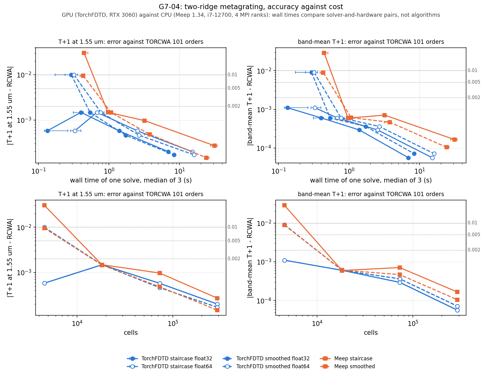

# G7 results

Results of the G7 application workflows and cost measurements declared in
[G7_WORKFLOWS.md](G7_WORKFLOWS.md). Each section is written from its own committed records.

## G7-04: independent solver at matched accuracy

Declared in [G7_WORKFLOWS.md](G7_WORKFLOWS.md) (section G7-04) and
[`docs/validation/cases/G7-04r2.json`](validation/cases/G7-04r2.json), which states the reference check used here. Code:
[`examples/g7/solvers/`](../examples/g7/solvers). Records:
[`docs/validation/g7/G7-04/`](validation/g7/G7-04), one JSON file per point plus `rcwa_reference.json`
and `summary.json`. `summary.json`, the tables below and the figure are produced by
`examples/g7/solvers/analyze.py` from the point records; `tests/test_g7_solvers.py` recomputes them.

**Hardware.** TorchFDTD ran on a GPU (NVIDIA RTX 3060, fused CUDA kernels) and Meep 1.34 on a CPU (Intel i7-12700, 4 MPI ranks in WSL). Wall times therefore compare two solver-and-hardware combinations on a shared workstation; no conclusion about the algorithms is drawn from the cost ratio. The cell-count axis is hardware-independent.

**Package.** The TorchFDTD records come from a checkout import of this branch (each record names the file,
version 0.15.0, `torchfdtd_import: checkout` and the git commit). The release-candidate round re-runs the
TorchFDTD points with the installed wheel; the driver imports an installed package when one exists.

### Fixture

| Quantity | Value |
|---|---|
| Problem | two-ridge metagrating of `examples/meep_comparison/metagrating/geometry.json`, TE (Ez), normal incidence from the substrate |
| Observables | T+1 at 1.55 um; band-mean T+1 over the 41 wavelengths 1.50 to 1.60 um; error = absolute difference to the reference |
| Order decomposition | the Fourier decomposition of `examples/meep_comparison/metagrating/compare.py`, applied to the recorded per-order Fourier means of Ez and Hx on the two DFT lines |
| TorchFDTD | NVIDIA RTX 3060, fused CUDA kernels, CUDA graph, float32 and float64 fields (DFT in float64); meshes 0.04, 0.02, 0.01, 0.005 um |
| Meep | 1.34.0, float64, 4 MPI ranks on the Intel i7-12700 in the WSL distribution torchfdtd-bench; resolutions 25, 50, 100, 200 per um |
| Time and absorber | 560.4 fs (the base 12,000 steps at 0.02 um) and 0.4 um at every mesh, Courant number 0.700036 |
| Staircase series | Meep `eps_averaging=False`, TorchFDTD staircase Yee sampling; at 0.01 and 0.005 um all six material edges would lie on Ez nodes, so the whole structure moves by half a cell in +x and +y (0.005 and 0.0025 um); source and DFT lines stay |
| Smoothed series | Meep default subpixel averaging, TorchFDTD experimental subpixel interfaces (quadrature 8), no shift |
| Timing | per point one bare-substrate reference run, one warm-up and three timed grating runs; cost = wall time of one full grating solve (setup and stepping), median and range of the three |

Derived geometry per mesh (`common.derive_geometry`, the same for both solvers):

| mesh (um) | Meep resolution (1/um) | cells | absorber cells per y face | steps | dt (s) | staircase shift (um) | Ez rows in the ridge, TorchFDTD / Meep (staircase) |
|---|---|---|---|---|---|---|---|
| 0.04 | 25 | 50 x 91 | 10 | 6,000 | 9.340271e-17 | 0 | 13 / 12 |
| 0.02 | 50 | 100 x 182 | 20 | 12,000 | 4.670136e-17 | 0 | 25 / 25 |
| 0.01 | 100 | 200 x 364 | 40 | 24,000 | 2.335068e-17 | 0.005 | 50 / 50 |
| 0.005 | 200 | 400 x 728 | 80 | 48,000 | 1.167534e-17 | 0.0025 | 100 / 100 |

Two grid facts shape the coarse end of the curves. TorchFDTD places Ez nodes at -L/2 + i h, and Meep
places them at integer multiples of h from the cell centre (read back from `get_chi1inv`). The two sets
coincide on an axis with an even cell count, so the solvers share their staircase at 0.02, 0.01 and
0.005 um. At 0.04 um the 3.64 um cell has 91 rows, and the y nodes lie half a cell apart: TorchFDTD
samples the 0.5 um ridges on 13 rows and Meep on 12 (recorded `silicon_rows`). The staircase curves of
the two solvers at 0.04 um therefore describe different discrete structures. Separately,
`Region.pml_cells` is capped at 50, so the TorchFDTD absorber is set per face with
`BoundaryFace(kind='pml', layers=n)` (80 cells at 0.005 um), with no package change.

### Reference

| TORCWA orders | T+1(1.55) | band-mean T+1 | role |
|---|---|---|---|
| 101 | 0.774640 | 0.770030 | reference |
| 241 | 0.774649 | 0.770031 | check (case G7-04r2) |
| largest difference, six efficiencies x 41 wavelengths | 6.4e-05 (T+1 at 1.50 um) | limit 1e-04 | pass |

The reference is TORCWA 0.1.4.2 with 101 Fourier orders (complex128 on CUDA, `solve()` of `rcwa_metagrating.py` on the unshifted geometry). As declared in case G7-04r2, it is checked against 241 orders: the largest difference over the six efficiencies and 41 wavelengths is 6.4e-05 (T+1 at 1.50 um), within the limit 1e-04. T+1(1.55) and the band mean differ by 9.7e-06 and 8.7e-07, far below the smallest error target 0.002. Every error below is measured against the 101-order values.

### All points

| solver | series | precision | mesh (um) | resolution (1/um) | cells | steps | median time (s) | range (s) | T+1(1.55) | error | band-mean T+1 | error |
|---|---|---|---|---|---|---|---|---|---|---|---|---|
| TorchFDTD | staircase | float32 | 0.04 | 25 | 50 x 91 = 4,550 | 6,000 | 0.134 | 0.121-0.261 | 0.77406 | 5.78e-04 | 0.77113 | 1.10e-03 |
| TorchFDTD | staircase | float32 | 0.02 | 50 | 100 x 182 = 18,200 | 12,000 | 0.401 | 0.312-0.433 | 0.77612 | 1.48e-03 | 0.77063 | 6.04e-04 |
| TorchFDTD | staircase | float32 | 0.01 | 100 | 200 x 364 = 72,800 | 24,000 | 1.393 | 1.368-1.423 | 0.77521 | 5.74e-04 | 0.77032 | 2.95e-04 |
| TorchFDTD | staircase | float32 | 0.005 | 200 | 400 x 728 = 291,200 | 48,000 | 6.936 | 6.925-7.031 | 0.77484 | 1.99e-04 | 0.77009 | 5.64e-05 |
| TorchFDTD | staircase | float64 | 0.04 | 25 | 50 x 91 = 4,550 | 6,000 | 0.329 | 0.287-0.400 | 0.77406 | 5.78e-04 | 0.77113 | 1.10e-03 |
| TorchFDTD | staircase | float64 | 0.02 | 50 | 100 x 182 = 18,200 | 12,000 | 0.675 | 0.652-0.679 | 0.77612 | 1.48e-03 | 0.77063 | 6.04e-04 |
| TorchFDTD | staircase | float64 | 0.01 | 100 | 200 x 364 = 72,800 | 24,000 | 2.537 | 2.537-2.561 | 0.77521 | 5.74e-04 | 0.77032 | 2.95e-04 |
| TorchFDTD | staircase | float64 | 0.005 | 200 | 400 x 728 = 291,200 | 48,000 | 15.072 | 14.977-15.074 | 0.77484 | 1.99e-04 | 0.77009 | 5.64e-05 |
| TorchFDTD | smoothed | float32 | 0.04 | 25 | 50 x 91 = 4,550 | 6,000 | 0.293 | 0.173-0.316 | 0.78464 | 1.00e-02 | 0.77913 | 9.10e-03 |
| TorchFDTD | smoothed | float32 | 0.02 | 50 | 100 x 182 = 18,200 | 12,000 | 0.538 | 0.513-0.546 | 0.77612 | 1.48e-03 | 0.77063 | 6.04e-04 |
| TorchFDTD | smoothed | float32 | 0.01 | 100 | 200 x 364 = 72,800 | 24,000 | 1.718 | 1.705-1.730 | 0.77510 | 4.60e-04 | 0.77039 | 3.64e-04 |
| TorchFDTD | smoothed | float32 | 0.005 | 200 | 400 x 728 = 291,200 | 48,000 | 8.354 | 8.340-8.486 | 0.77481 | 1.69e-04 | 0.77010 | 7.17e-05 |
| TorchFDTD | smoothed | float64 | 0.04 | 25 | 50 x 91 = 4,550 | 6,000 | 0.319 | 0.240-0.358 | 0.78464 | 1.00e-02 | 0.77913 | 9.10e-03 |
| TorchFDTD | smoothed | float64 | 0.02 | 50 | 100 x 182 = 18,200 | 12,000 | 0.767 | 0.734-0.853 | 0.77612 | 1.48e-03 | 0.77063 | 6.04e-04 |
| TorchFDTD | smoothed | float64 | 0.01 | 100 | 200 x 364 = 72,800 | 24,000 | 2.679 | 2.629-2.707 | 0.77510 | 4.60e-04 | 0.77039 | 3.64e-04 |
| TorchFDTD | smoothed | float64 | 0.005 | 200 | 400 x 728 = 291,200 | 48,000 | 16.032 | 16.032-16.044 | 0.77481 | 1.69e-04 | 0.77010 | 7.16e-05 |
| Meep | staircase | float64 | 0.04 | 25 | 50 x 91 = 4,550 | 6,000 | 0.443 | 0.437-0.502 | 0.74398 | 3.07e-02 | 0.74111 | 2.89e-02 |
| Meep | staircase | float64 | 0.02 | 50 | 100 x 182 = 18,200 | 12,000 | 0.965 | 0.924-0.969 | 0.77612 | 1.48e-03 | 0.77063 | 5.97e-04 |
| Meep | staircase | float64 | 0.01 | 100 | 200 x 364 = 72,800 | 24,000 | 3.197 | 3.195-3.236 | 0.77561 | 9.69e-04 | 0.77074 | 7.11e-04 |
| Meep | staircase | float64 | 0.005 | 200 | 400 x 728 = 291,200 | 48,000 | 31.316 | 27.483-34.272 | 0.77491 | 2.70e-04 | 0.77020 | 1.66e-04 |
| Meep | smoothed | float64 | 0.04 | 25 | 50 x 91 = 4,550 | 6,000 | 0.431 | 0.389-0.445 | 0.78425 | 9.62e-03 | 0.77896 | 8.93e-03 |
| Meep | smoothed | float64 | 0.02 | 50 | 100 x 182 = 18,200 | 12,000 | 1.073 | 1.016-1.137 | 0.77610 | 1.46e-03 | 0.77064 | 6.11e-04 |
| Meep | smoothed | float64 | 0.01 | 100 | 200 x 364 = 72,800 | 24,000 | 3.768 | 3.161-3.796 | 0.77512 | 4.82e-04 | 0.77050 | 4.67e-04 |
| Meep | smoothed | float64 | 0.005 | 200 | 400 x 728 = 291,200 | 48,000 | 24.005 | 23.218-26.039 | 0.77479 | 1.46e-04 | 0.77013 | 1.05e-04 |

### Equal cell count

Same mesh, therefore the same cells and steps in both solvers. Errors are for T+1 at 1.55 um and for
the band mean; time is the median full solve.

| mesh (um) | cells | steps | series | TorchFDTD float32: error 1.55 / error band / time (s) | TorchFDTD float64: error 1.55 / error band / time (s) | Meep float64: error 1.55 / error band / time (s) |
|---|---|---|---|---|---|---|
| 0.04 | 4,550 | 6,000 | staircase | 5.78e-04 / 1.10e-03 / 0.134 | 5.78e-04 / 1.10e-03 / 0.329 | 3.07e-02 / 2.89e-02 / 0.443 |
| 0.04 | 4,550 | 6,000 | smoothed | 1.00e-02 / 9.10e-03 / 0.293 | 1.00e-02 / 9.10e-03 / 0.319 | 9.62e-03 / 8.93e-03 / 0.431 |
| 0.02 | 18,200 | 12,000 | staircase | 1.48e-03 / 6.04e-04 / 0.401 | 1.48e-03 / 6.04e-04 / 0.675 | 1.48e-03 / 5.97e-04 / 0.965 |
| 0.02 | 18,200 | 12,000 | smoothed | 1.48e-03 / 6.04e-04 / 0.538 | 1.48e-03 / 6.04e-04 / 0.767 | 1.46e-03 / 6.11e-04 / 1.073 |
| 0.01 | 72,800 | 24,000 | staircase | 5.74e-04 / 2.95e-04 / 1.393 | 5.74e-04 / 2.95e-04 / 2.537 | 9.69e-04 / 7.11e-04 / 3.197 |
| 0.01 | 72,800 | 24,000 | smoothed | 4.60e-04 / 3.64e-04 / 1.718 | 4.60e-04 / 3.64e-04 / 2.679 | 4.82e-04 / 4.67e-04 / 3.768 |
| 0.005 | 291,200 | 48,000 | staircase | 1.99e-04 / 5.64e-05 / 6.936 | 1.99e-04 / 5.64e-05 / 15.072 | 2.70e-04 / 1.66e-04 / 31.316 |
| 0.005 | 291,200 | 48,000 | smoothed | 1.69e-04 / 7.17e-05 / 8.354 | 1.69e-04 / 7.16e-05 / 16.032 | 1.46e-04 / 1.05e-04 / 24.005 |

### Equal error

Cost to reach each error, as wall time / cell-steps (cells times steps). Interpolation is log-log
between the two meshes that bracket the last crossing of the target, in refinement order; every finer
point stays at or below the target. "<=" means the coarsest mesh already meets the target, so its cost
is an upper bound. "not reached" means the finest point exceeds it.

| curve | observable | error 0.01 | error 0.005 | error 0.002 |
|---|---|---|---|---|
| TorchFDTD staircase float32 | T+1 at 1.55 um | <= 0.134 s / <= 2.73e+07 | <= 0.134 s / <= 2.73e+07 | <= 0.134 s / <= 2.73e+07 |
| TorchFDTD staircase float32 | band-mean T+1 | <= 0.134 s / <= 2.73e+07 | <= 0.134 s / <= 2.73e+07 | <= 0.134 s / <= 2.73e+07 |
| TorchFDTD staircase float64 | T+1 at 1.55 um | <= 0.329 s / <= 2.73e+07 | <= 0.329 s / <= 2.73e+07 | <= 0.329 s / <= 2.73e+07 |
| TorchFDTD staircase float64 | band-mean T+1 | <= 0.329 s / <= 2.73e+07 | <= 0.329 s / <= 2.73e+07 | <= 0.329 s / <= 2.73e+07 |
| TorchFDTD smoothed float32 | T+1 at 1.55 um | <= 0.293 s / <= 2.73e+07 | 0.365 s / 5.8e+07 | 0.489 s / 1.57e+08 |
| TorchFDTD smoothed float32 | band-mean T+1 | <= 0.293 s / <= 2.73e+07 | 0.335 s / 4.32e+07 | 0.411 s / 8.72e+07 |
| TorchFDTD smoothed float64 | T+1 at 1.55 um | <= 0.319 s / <= 2.73e+07 | 0.438 s / 5.8e+07 | 0.667 s / 1.57e+08 |
| TorchFDTD smoothed float64 | band-mean T+1 | <= 0.319 s / <= 2.73e+07 | 0.387 s / 4.32e+07 | 0.521 s / 8.72e+07 |
| Meep staircase | T+1 at 1.55 um | 0.591 s / 5.89e+07 | 0.706 s / 9.48e+07 | 0.893 s / 1.78e+08 |
| Meep staircase | band-mean T+1 | 0.548 s / 4.82e+07 | 0.63 s / 6.99e+07 | 0.757 s / 1.14e+08 |
| Meep smoothed | T+1 at 1.55 um | <= 0.431 s / <= 2.73e+07 | 0.591 s / 5.61e+07 | 0.921 s / 1.54e+08 |
| Meep smoothed | band-mean T+1 | <= 0.431 s / <= 2.73e+07 | 0.525 s / 4.28e+07 | 0.717 s / 8.71e+07 |



Top row: error against the median wall time, with bars for the range of the three timed runs. Bottom
row: error against the cell count, which does not depend on the hardware. Dotted lines mark the targets.

### Observations

1. **Shared staircase.** Where the two solvers share their Ez nodes (0.02, 0.01 and 0.005 um) their staircases are identical (recorded silicon columns and rows). At 0.02 um the T+1(1.55) errors are 1.5e-03 (TorchFDTD) and 1.5e-03 (Meep). At 0.01 and 0.005 um they are 5.7e-04 and 2.0e-04 for TorchFDTD against 9.7e-04 and 2.7e-04 for Meep. At those two meshes the fixture's DFT lines fall on Ez rows instead of between them, and Meep's sum of order efficiencies at 1.55 um rises to 1.00036 and 1.00011 (TorchFDTD 0.99992 and 1.00005). A development check at 0.01 um (`readout_check.py`, records `readout_check_*.json`, not a declared quantity) that moves both lines by +h/2 onto pixel centres moves Meep's T+1(1.55) by -5.4e-04 and its order sum from 1.00036 to 0.99974 and moves TorchFDTD's by -1.2e-04 (order sum 0.99992 to 0.99978). With the moved lines the two solvers give T+1(1.55) = 0.775095 and 0.775071, a difference of 2.4e-05. The solver difference at 0.01 um therefore comes almost entirely from how each solver reads fields on a line that lies on a node row, not from the discretization. The curves keep the fixture's lines.
2. **The coarsest mesh is decided by grid registration.** At 0.04 um the 91 rows put TorchFDTD's and Meep's y nodes half a cell apart, so the 0.5 um ridges cover 13 rows in TorchFDTD and 12 in Meep, and the ridge-2 width is sampled as 5 nodes (0.20 um against 0.22 um) in both. TorchFDTD's staircase (ridges 0.02 um too tall, ridge 2 0.02 um too narrow) happens to land close to the reference: error 5.8e-04, smaller than at 0.02 um (1.5e-03). Meep's (0.02 um too short) has 3.1e-02. The staircase equal-error rows follow from this: TorchFDTD meets every target already at 0.04 um, and Meep needs about 0.02 um. This is a property of the node placement with an odd cell count, not of either solver's accuracy.
3. **Smoothed series.** The two smoothed curves track each other at every mesh: T+1(1.55) errors 1.0e-02, 1.5e-03, 4.6e-04, 1.7e-04 (TorchFDTD subpixel) against 9.6e-03, 1.5e-03, 4.8e-04, 1.5e-04 (Meep subpixel averaging). At 0.02 um every edge lies on a dual-cell face, so TorchFDTD's subpixel operator reduces to the staircase (observables equal within 2e-08). At 0.01 and 0.005 um, where the shifted staircase puts every edge midway between nodes, smoothing lowers TorchFDTD's T+1(1.55) error only slightly (4.6e-04 against 5.7e-04, 1.7e-04 against 2.0e-04); at 0.04 um both smoothed errors are about 1e-2, far above TorchFDTD's staircase error there. On this axis-aligned structure the smoothing gains little over a staircase whose edges sit midway between nodes.
4. **float32 against float64.** TorchFDTD's two precisions give the same observables within 8.6e-08 at every mesh. float64 costs 2.17 times the float32 wall time at 0.005 um (staircase) and 1.92 times (smoothed).
5. **Equal error.** For T+1(1.55) at 0.002: TorchFDTD staircase float32 at most 0.13 s, Meep staircase 0.89 s; TorchFDTD smoothed float32 0.49 s, Meep smoothed 0.92 s. In cell-steps, which does not depend on the hardware, the smoothed series need 1.57e+08 (TorchFDTD) and 1.54e+08 (Meep) for the same target, about the same grid; the wall-time ratio comes from the GPU against the CPU and says nothing about the algorithms. One entry is marginal: TorchFDTD's smoothed error at 0.04 um is 0.009997, below 0.01 by 3.2e-06; against the 241-order value it is 0.009987, so the '<=' entry at 0.01 holds either way.
6. **Equal cell count.** At the same mesh the wall times differ by the hardware and by fixed overheads: at 0.04 um (4,550 cells, 6,000 steps) TorchFDTD takes 0.134 s and Meep 0.443 s; at 0.005 um (291,200 cells, 48,000 steps) 6.94 s against 31.3 s (staircase). That is 204 million cell-steps per second for TorchFDTD at 0.04 um against 2015 million at 0.005 um (Meep 62 and 446 million): the small meshes measure fixed per-run and per-step overheads more than stepping.

### Acceptance

| Acceptance item | Result | Evidence |
|---|---|---|
| every point recorded with median and range | pass | 24 points (16 TorchFDTD, 8 Meep), each one warm-up and three timed runs; `min`, `median`, `max` and every sample in the point records |
| accuracy-versus-cost curves of both solvers rendered from the record | pass | `docs/figures/g7/G7-04.png`, rendered by `analyze.py` from `summary.json`; `tests/test_g7_solvers.py` recomputes the summary from the point records |
| cost to reach 0.01, 0.005, 0.002 by log-log interpolation per solver and series | pass | the equal-error table, for both observables, both series and both TorchFDTD precisions |
| equal-cell-count and equal-error comparisons reported separately | pass | the two tables above |
| the record states CPU against GPU and draws no algorithmic conclusion | pass | `hardware_statement` in `summary.json`, the Hardware paragraph and the figure subtitle |
| reference check of the fixture: 101 against 241 orders, every efficiency at most 1e-04 | pass | 6.4e-05; see Reference |

### Notes and open items

- Package: the TorchFDTD records come from a checkout import of this branch; the release-candidate round re-runs the TorchFDTD points with the installed wheel. The driver imports an installed torchfdtd when one exists (repository root appended to the end of `sys.path`). Every record states `torchfdtd_file`, `torchfdtd_version`, `torchfdtd_import` and the git commit. The Windows venv also holds an editable install of the main checkout; path imports take precedence over its finder, and the records name the file that ran.
- Absorber: `Region.pml_cells` is capped at 50, so the 80-cell absorber at 0.005 um (and every other mesh) is set with `BoundaryFace(kind='pml', layers=n)` on the y faces; no package change. The derived geometry notes record this.
- The two solvers do not share Ez nodes in y at 0.04 um (91 rows); their staircases differ there (13 against 12 ridge rows).
- Host load: timed runs were taken on a quiet host, each gated on a Windows host load of at most 30 % (sampled before the run and recorded in every sample). Runs first taken at 90-100 % host load (Meep resolution 25 at 4.9 s against 0.44 s quiet, TorchFDTD about 2x slower) were re-measured; their accuracy values were identical, and they are kept outside the repository. Three timed samples have no load reading (the PowerShell query returned nothing): Meep smoothed resolution 100 run 1 and TorchFDTD staircase float32 0.005 um runs 1 and 3; their times lie within the ranges of their points. No other job used the GPU during the TorchFDTD timings (GPU memory in use before every point stayed at the 1.25-1.44 GB desktop level).
- Meep runs in WSL with 4 MPI ranks on a 12-core CPU and TorchFDTD on the GPU; the cost ratio compares these two setups only.

### Reproduce

From the repository root. The timed runs need an otherwise idle GPU and host; the TorchFDTD and TORCWA runs
use CUDA, and Meep runs with MPI (here in a Linux environment under WSL).

```bash
# reference: a Python environment with TORCWA 0.1.4.2 (CUDA)
python examples/g7/solvers/rcwa_reference.py
# TorchFDTD, four calls: --series staircase|smoothed, --precision float32|float64
python examples/g7/solvers/torchfdtd_sweep.py --series staircase --precision float32 --max-host-cpu-percent 30
# Meep 1.34, two calls: --series staircase|smoothed
OMP_NUM_THREADS=1 mpirun -np 4 python examples/g7/solvers/meep_sweep.py --ranks 4 --series staircase --max-host-cpu-percent 30
# analysis, tables and figure (reads records only)
python examples/g7/solvers/analyze.py
# tests: fast checks, then the acceptance check from the committed records
python -m pytest tests/test_g7_solvers.py
TORCHFDTD_G7_FULL=1 python -m pytest tests/test_g7_solvers.py
```
