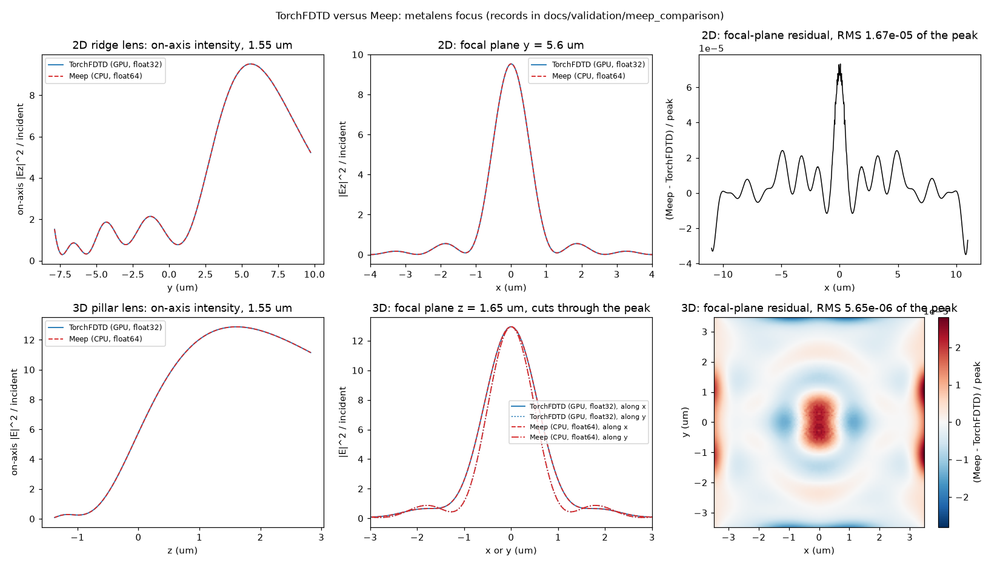

# Compared with Meep

Rendered by `scripts/render_meep_comparison.py` from the records in `docs/validation/meep_comparison/`; do not edit by hand. Each example sets up one device from one geometry file and runs it in TorchFDTD (0.14.0.dev0, NVIDIA GeForce RTX 3060, fused CUDA kernels) and in Meep 1.34.0 (MPI ranks on the 12th Gen Intel(R) Core(TM) i7-12700) on the same grid, time step, step count, source, monitors and staircase material sampling; the agreement criteria were declared in each example's `criteria.json` before the first comparison run. The rules shared by the three examples are in [`examples/meep_comparison/BRIEF.md`](../examples/meep_comparison/BRIEF.md).

Timing rows marked "development run, shared host" are single runs made while other jobs used the CPU and the GPU; they bound the solver time from above and are replaced by the maintainer's `--timing` rerun (one warm-up, three timed solves, Meep with 12 ranks on a quiet host) once `<name>_<solver>_timing.json` records exist.

## Summary

| Example | Cells x steps | Agreement (headline metric) | Criteria | TorchFDTD stepping (s) | Meep stepping (s), ranks | Ratio |
|---|---|---|---|---|---|---|
| [Microring resonator](#microring-resonator) | 469,500 x 89,219 | resonance wavelengths, max difference 5.6e-05 nm (limit 0.2 nm) | 5/5 pass | 31.36 | 217.05, 4 ranks (development run, shared host) | 6.9 |
| [Metalens: 2D ridge lens (Part A)](#metalens-2d-ridge-lens-part-a) | 825,600 x 5,200 | focusing efficiency, difference 4.0e-06 (limit 0.01) | 4/4 pass | 1.57 | 13.29, 4 ranks (development run, shared host) | 8.5 |
| [Metalens: 3D pillar lens (Part B)](#metalens-3d-pillar-lens-part-b) | 3,430,400 x 2,500 | focusing efficiency, difference 2.1e-06 (limit 0.01) | 5/5 pass | 6.06 | 128.60, 4 ranks (development run, shared host) | 21.2 |
| [Metagrating with an RCWA oracle](#metagrating-with-an-rcwa-oracle) | 18,200 x 12,000 | order efficiencies, max difference 2.0e-04 (limit 0.01) | 5/5 pass | 0.26 | 1.49, 4 ranks (development run, shared host) | 5.7 |

## Microring resonator

Example folder: [`examples/meep_comparison/microring`](../examples/meep_comparison/microring) (README with the full fixture table, the two solver scripts, `compare.py`, `criteria.json`).

### Device

A 2D microring resonator side-coupled to a straight bus waveguide, out-of-plane E field (Ez), excited by one Gaussian pulse centred at 1.55 um (4 cycles) on an Ez line across the bus; the observable is the through-port transmission T = out-plane flux of the ring run over the same flux of a straight-bus run of the same solver, on 401 wavelength samples. The ring, bus, gap and index values are in the example README and `geometry.json`.

### Fixture

| Fixture | Value |
|---|---|
| Cells per axis | 750 x 626 |
| Cells | 469,500 |
| Mesh (um) | 0.024 |
| Time step (s) | 5.604163e-17 |
| Courant number | 0.700036 |
| Steps | 89,219 |
| Absorber (cells) | 42 (TorchFDTD CPML, Meep PML; the thickness is the only shared parameter) |
| Precision | TorchFDTD float32, Meep float64 |
| Geometry file sha256 | f7f2aaf2d067 (both records) |
| Run time (ps) | 5.000 |
| Interior core Ez nodes (staircase) | 39,853 (both records) |

### Agreement

Declared criteria: 5 of 5 pass.

| Quantity | TorchFDTD | Meep | Difference | Criterion | Result |
|---|---|---|---|---|---|
| Resonances found in the band | 8 | 8 | same count | same count | pass |
| Resonance wavelengths, max abs difference (nm) | - | - | 5.6e-05 | <= 0.2 | pass |
| Resonance nearest 1.55 um, centre (nm) | 1537.508 | 1537.508 | 3.2e-05 | <= 0.2 | pass |
| Loaded Q of that resonance (Lorentzian fit) | 1960.9 | 1960.9 | 8.6e-06 relative | <= 0.05 relative | pass |
| Extinction ratio of that resonance (dB) | 2.325 | 2.325 | 7.4e-05 | <= 1.0 | pass |
| Free spectral range (nm) | 27.19 | 27.19 | 1.8e-06 | reported | - |
| RMS of T_torchfdtd - T_meep over the band | - | - | 4.87e-06 | <= 0.02 | pass |
| Max abs T_torchfdtd - T_meep | - | - | 2.35e-05 | reported | - |
| Grid, dt, steps, PML, geometry and staircase hash | b937c9bfeae3 | b937c9bfeae3 | - | equal | pass |

### Timing

| Cells | Steps | TorchFDTD stepping (s), NVIDIA GeForce RTX 3060 | Meep stepping (s), CPU | Meep ranks | Ratio Meep / TorchFDTD | Timing mode |
|---|---|---|---|---|---|---|
| 469,500 | 89,219 | 31.36 (35.10 full) | 217.05 (217.11 full) | 4 | 6.9 | development run, shared host |

Load condition, TorchFDTD (`microring_torchfdtd.json`): development run on a shared workstation: other GPU and CPU jobs may have been running; WSL load average before [2.70703125, 3.4658203125, 3.20654296875], after [1.447265625, 2.88232421875, 3.0205078125]; GPU memory used before the run 2737.0 MiB, GPU utilisation before the run 8.0 %.

Load condition, Meep (`microring_meep.json`): development run with 4 MPI ranks on a shared workstation (20 logical CPUs; other jobs may have been running); WSL load average before [2.9169921875, 3.0263671875, 2.87890625], after [4.0, 3.76171875, 3.29150390625].

### Figure


Through-port transmission of both solvers overlaid, with the difference; rendered by `compare.py` from the records only.

### Running it

From the repository root inside the WSL2 distribution `torchfdtd-bench` (on Windows: `wsl.exe -d torchfdtd-bench -- bash -lc "<command>"`); `compare.py` needs only numpy, scipy and matplotlib.

```bash
PYTHONPATH=$PWD python examples/meep_comparison/microring/torchfdtd_microring.py
OMP_NUM_THREADS=1 mpirun -np 4 python examples/meep_comparison/microring/meep_microring.py --ranks 4
python examples/meep_comparison/microring/compare.py
```

Both solver scripts take `--out <path>` and `--timing`; `--ranks 12` with `mpirun -np 12` for the maintainer's timed Meep run.

### Fairness limits

- Identical and proven by the records: the geometry file (sha256), the Yee grid, dt, Courant number and step count, the staircase permittivity at every interior Ez node (one sha256 in both records), the source nodes and weights, the monitor columns and rows, the frequency samples and the DFT window (whole run, no apodization).
- Different by construction: the absorber formulation (TorchFDTD CPML with a cubic sigma profile, Meep stretched-coordinate PML with a quadratic profile; 42 cells in both), the stepping precision (TorchFDTD float32 with float64 DFT accumulators, Meep float64) and the flux quadrature on the monitor plane (TorchFDTD interpolates E and H to cell midpoints, Meep integrates over the Ez nodes with end weights); these cancel in the ratio T.
- No symmetry planes, no subpixel averaging, no coarse-then-fine in either solver.

## Metalens: 2D ridge lens (Part A)

Example folder: [`examples/meep_comparison/metalens`](../examples/meep_comparison/metalens) (README with the full fixture table, the two solver scripts, `compare.py`, `criteria.json`).

### Device

A 2D cylindrical lens of silicon ridges in air, Ez polarisation, illuminated by a 3-cycle Gaussian plane-wave pulse centred at 1.55 um from below; the focal line and the on-axis line are DFT monitors, and every quantity is a ratio to a bare-cell run of the same solver. Aperture, focal length, pitch and ridge widths are in the example README and `geometry.json`.

### Fixture

| Fixture | Value |
|---|---|
| Cells per axis | 960 x 860 |
| Cells | 825,600 |
| Mesh (um) | 0.025 |
| Time step (s) | 5.837669e-17 |
| Courant number | 0.700036 |
| Steps | 5,200 |
| Absorber (cells) | 40 (TorchFDTD CPML, Meep PML; the thickness is the only shared parameter) |
| Precision | TorchFDTD float32, Meep float64 |
| Geometry file sha256 | a746d5538bf1 (both records) |
| Silicon Yee samples (staircase) | Ex 16,560, Ey 16,769, Ez 16,360 (TorchFDTD; Meep equal where recorded) |

### Agreement

Declared criteria: 4 of 4 pass.

| Metric | TorchFDTD | Meep | Difference | Criterion | Result |
|---|---|---|---|---|---|
| Focal position (um) | 5.6000 | 5.5992 | 7.87e-04 um | <= 0.1 um | pass |
| Focal-plane FWHM (um) | 1.1629 | 1.1629 | 1.38e-05 relative | <= 0.03 relative | pass |
| Focal-plane profile RMS difference / peak | 9.5296 | 9.5303 | 1.67e-05 of the peak | <= 0.03 of the peak | pass |
| Focusing efficiency | 0.5571 | 0.5571 | 3.96e-06 | <= 0.01 | pass |
| Transmission through the aperture plane | 0.6740 | 0.6741 | 1.18e-04 | information | - |
| On-axis peak intensity / incident | 9.5137 | 9.5143 | 6.67e-04 | information | - |
| Cells, dt, steps, PML, geometry sha256, silicon staircase counts, source support | - | - | - | equal | pass |

### Timing

| Cells | Steps | TorchFDTD stepping (s), NVIDIA GeForce RTX 3060 | Meep stepping (s), CPU | Meep ranks | Ratio Meep / TorchFDTD | Timing mode |
|---|---|---|---|---|---|---|
| 825,600 | 5,200 | 1.57 (1.66 full) | 13.29 (13.39 full) | 4 | 8.5 | development run, shared host |

Load condition, TorchFDTD (`metalens_2d_torchfdtd.json`): development run on a shared host: other agents used the CPU and the GPU at the same time; the numbers bound the solver time from above

Load condition, Meep (`metalens_2d_meep.json`): development run on a shared host: other agents used the CPU and the GPU at the same time; the numbers bound the solver time from above

### Figure



Focal-plane profiles and on-axis intensity of both parts, both solvers overlaid; rendered by `compare.py` from the records only.

### Running it

From the repository root inside the WSL2 distribution `torchfdtd-bench` (on Windows: `wsl.exe -d torchfdtd-bench -- bash -lc "<command>"`); `compare.py` needs only numpy, scipy and matplotlib.

```bash
PYTHONPATH=$PWD python examples/meep_comparison/metalens/torchfdtd_metalens.py --part 2d
OMP_NUM_THREADS=1 mpirun -np 4 python examples/meep_comparison/metalens/meep_metalens.py --part 2d --ranks 4
python examples/meep_comparison/metalens/compare.py
```

Both solver scripts take `--out <path>` and `--timing`; `--ranks 12` with `mpirun -np 12` for the maintainer's timed Meep run.

### Fairness limits

- Identical and proven by the records: the geometry file (sha256), cells, mesh, dt, step count, the absorber thickness in cells, the source support with its boundary weights, the silicon sample counts per component, the monitor points and the three DFT frequencies; the reductions (peak, FWHM, windowed Poynting power) are one shared function set applied to both records.
- Different by construction: the absorber formulation (CPML with a cubic profile against Meep PML with a quadratic profile; 40 cells in both) and the stepping precision (TorchFDTD float32, Meep float64).
- No symmetry planes, no subpixel smoothing, no coarse-then-fine in either solver.

## Metalens: 3D pillar lens (Part B)

Example folder: [`examples/meep_comparison/metalens`](../examples/meep_comparison/metalens) (README with the full fixture table, the two solver scripts, `compare.py`, `criteria.json`).

### Device

A 3D lens of silicon cylinders on a square grid, x-polarised 3-cycle plane-wave pulse centred at 1.55 um from below; the focal plane and the xz and yz sections are DFT monitors, and every quantity is a ratio to a bare-cell run of the same solver. Aperture, pillar radii and pitch are in the example README and `geometry_3d.json`.

### Fixture

| Fixture | Value |
|---|---|
| Cells per axis | 160 x 160 x 134 |
| Cells | 3,430,400 |
| Mesh (um) | 0.05 |
| Time step (s) | 9.532874e-17 |
| Courant number | 0.571577 |
| Steps | 2,500 |
| Absorber (cells) | 10 (TorchFDTD CPML, Meep PML; the thickness is the only shared parameter) |
| Precision | TorchFDTD float32, Meep float64 |
| Geometry file sha256 | 6c318b9c25c3 (both records) |
| Silicon Yee samples (staircase) | Ex 35,808, Ey 35,808, Ez 36,288 (TorchFDTD; Meep equal where recorded) |

### Agreement

Declared criteria: 5 of 5 pass.

| Metric | TorchFDTD | Meep | Difference | Criterion | Result |
|---|---|---|---|---|---|
| Focal position (um) | 1.6061 | 1.6088 | 2.72e-03 um | <= 0.1 um | pass |
| Focal-plane FWHM along x (um) | 1.3229 | 1.3228 | 1.65e-05 relative | <= 0.03 relative | pass |
| Focal-plane FWHM along y (um) | 1.1239 | 1.1239 | 1.12e-05 relative | <= 0.03 relative | pass |
| Focal-plane profile RMS difference / peak | 12.9387 | 12.9390 | 5.65e-06 of the peak | <= 0.03 of the peak | pass |
| Focusing efficiency | 0.6232 | 0.6232 | 2.13e-06 | <= 0.01 | pass |
| Transmission through the aperture plane | 0.8408 | 0.8407 | 1.72e-05 | information | - |
| On-axis peak intensity / incident | 12.8747 | 12.8747 | 7.55e-05 | information | - |
| Cells, dt, steps, PML, geometry sha256, silicon staircase counts, source support | - | - | - | equal | pass |

### Timing

| Cells | Steps | TorchFDTD stepping (s), NVIDIA GeForce RTX 3060 | Meep stepping (s), CPU | Meep ranks | Ratio Meep / TorchFDTD | Timing mode |
|---|---|---|---|---|---|---|
| 3,430,400 | 2,500 | 6.06 (6.59 full) | 128.60 (129.07 full) | 4 | 21.2 | development run, shared host |

Load condition, TorchFDTD (`metalens_3d_torchfdtd.json`): development run on a shared host: other agents used the CPU and the GPU at the same time; the numbers bound the solver time from above

Load condition, Meep (`metalens_3d_meep.json`): development run on a shared host: other agents used the CPU and the GPU at the same time; the numbers bound the solver time from above

### Figure


Focal-plane profiles and on-axis intensity of both parts, both solvers overlaid; rendered by `compare.py` from the records only.

### Running it

From the repository root inside the WSL2 distribution `torchfdtd-bench` (on Windows: `wsl.exe -d torchfdtd-bench -- bash -lc "<command>"`); `compare.py` needs only numpy, scipy and matplotlib.

```bash
PYTHONPATH=$PWD python examples/meep_comparison/metalens/torchfdtd_metalens.py --part 3d
OMP_NUM_THREADS=1 mpirun -np 4 python examples/meep_comparison/metalens/meep_metalens.py --part 3d --ranks 4
python examples/meep_comparison/metalens/compare.py
```

Both solver scripts take `--out <path>` and `--timing`; `--ranks 12` with `mpirun -np 12` for the maintainer's timed Meep run.

### Fairness limits

- Identical and proven by the records: the geometry file (sha256), cells, mesh, dt, step count, the absorber thickness in cells, the source support with its boundary weights, the silicon sample counts per component, the monitor points and the three DFT frequencies; the reductions (peak, FWHM, windowed Poynting power) are one shared function set applied to both records.
- Different by construction: the absorber formulation (CPML with a cubic profile against Meep PML with a quadratic profile; 10 cells in both) and the stepping precision (TorchFDTD float32, Meep float64).
- No symmetry planes, no subpixel smoothing, no coarse-then-fine in either solver.

## Metagrating with an RCWA oracle

Example folder: [`examples/meep_comparison/metagrating`](../examples/meep_comparison/metagrating) (README with the full fixture table, the two solver scripts, `compare.py`, `criteria.json`).

### Device

A 2D beam-deflecting metagrating: two silicon ridges per period on a silica half-space, Ez polarisation, normal incidence from the substrate, periodic in x; the DFT lines in the substrate and in air are decomposed into the -1, +0, +1 diffraction orders by one Fourier routine applied to both records, on 41 wavelengths from 1.5 to 1.6 um, each order a ratio to the incident power of a bare-substrate run of the same solver. TORCWA 0.1.4.2 (RCWA, 120 harmonics) supplies a grid-free third answer.

### Fixture

| Fixture | Value |
|---|---|
| Cells per axis | 100 x 182 |
| Cells | 18,200 |
| Mesh (um) | 0.02 |
| Time step (s) | 4.670136e-17 |
| Courant number | 0.700036 |
| Steps | 12,000 |
| Absorber (cells) | 20 (TorchFDTD CPML, Meep PML; the thickness is the only shared parameter) |
| Precision | TorchFDTD float32, Meep float64 |
| Geometry file sha256 | 0b880d40dfae (both records) |

### Agreement

Declared criteria: 5 of 5 pass.

| Criterion | Measured | Where | Limit | Result |
|---|---|---|---|---|
| Order efficiencies, max abs TorchFDTD - Meep over the band | 2.03e-04 | 1.5 um, T+1 | <= 0.01 | pass |
| Order efficiencies, max abs TorchFDTD - RCWA over the band | 5.53e-03 | 1.5 um, R+0 | <= 0.02 | pass |
| Order efficiencies, max abs Meep - RCWA over the band | 5.41e-03 | 1.5 um, R+0 | <= 0.02 | pass |
| Energy balance, max abs (sum of orders - 1), TorchFDTD | 1.56e-03 | 1.5 um | <= 0.01 | pass |
| Energy balance, max abs (sum of orders - 1), Meep | 1.45e-03 | 1.5 um | <= 0.01 | pass |
| Cells, dt, steps, PML, geometry sha256, staircase, monitor positions | - | - | equal | pass |

Order efficiencies at the design wavelength:

| Order | TorchFDTD | Meep | RCWA | TorchFDTD - Meep | TorchFDTD - RCWA |
|---|---|---|---|---|---|
| T-1 at 1.55 um | 0.0405 | 0.0405 | 0.0365 | -5.8e-06 | +4.1e-03 |
| T+0 at 1.55 um | 0.0710 | 0.0710 | 0.0750 | -2.4e-06 | -4.0e-03 |
| T+1 at 1.55 um | 0.7761 | 0.7761 | 0.7746 | -5.8e-06 | +1.5e-03 |
| R-1 at 1.55 um | 0.0446 | 0.0446 | 0.0476 | +7.3e-06 | -3.0e-03 |
| R+0 at 1.55 um | 0.0157 | 0.0157 | 0.0156 | +3.6e-06 | +9.1e-05 |
| R+1 at 1.55 um | 0.0509 | 0.0509 | 0.0507 | -1.3e-06 | +1.9e-04 |

### Timing

| Cells | Steps | TorchFDTD stepping (s), NVIDIA GeForce RTX 3060 | Meep stepping (s), CPU | Meep ranks | Ratio Meep / TorchFDTD | Timing mode |
|---|---|---|---|---|---|---|
| 18,200 | 12,000 | 0.26 (0.31 full) | 1.49 (1.50 full) | 4 | 5.7 | development run, shared host |

Load condition, TorchFDTD (`metagrating_torchfdtd.json`): development run on a shared host: GPU utilisation before the run 11%, host CPU 45.0%; not a timing measurement

Load condition, Meep (`metagrating_meep.json`): development run with 4 ranks on a shared host: host CPU 62.0% before the run, GPU utilisation 9% (other jobs); not a timing measurement

### Figure


Diffraction-order efficiencies over the band for the three methods; rendered by `compare.py` from the records only.

### Running it

From the repository root inside the WSL2 distribution `torchfdtd-bench` (on Windows: `wsl.exe -d torchfdtd-bench -- bash -lc "<command>"`); `compare.py` needs only numpy, scipy and matplotlib.

```bash
PYTHONPATH=$PWD python examples/meep_comparison/metagrating/torchfdtd_metagrating.py --out docs/validation/meep_comparison/metagrating_torchfdtd.json
OMP_NUM_THREADS=1 mpirun -np 4 python examples/meep_comparison/metagrating/meep_metagrating.py --ranks 4 --out docs/validation/meep_comparison/metagrating_meep.json
python examples/meep_comparison/metagrating/compare.py
```

Both solver scripts take `--out <path>` and `--timing`; `--ranks 12` with `mpirun -np 12` for the maintainer's timed Meep run.

### Fairness limits

- Identical and proven by the records: the geometry file (sha256), cells, dt, steps, the absorber thickness in cells, the silicon staircase read back from each solver's own permittivity array, the pulse (max difference between the TorchFDTD waveform and the shared function 0.0), the DFT line positions and the frequency samples.
- Different by construction: the absorber formulation (CPML with a cubic profile against Meep PML with a quadratic profile; 20 cells in both) and the stepping precision (TorchFDTD float32 with float64 DFT accumulation, Meep float64).
- The RCWA record is a different method (Fourier-series geometry, no grid, no time stepping) and is held to its own, wider limit.
