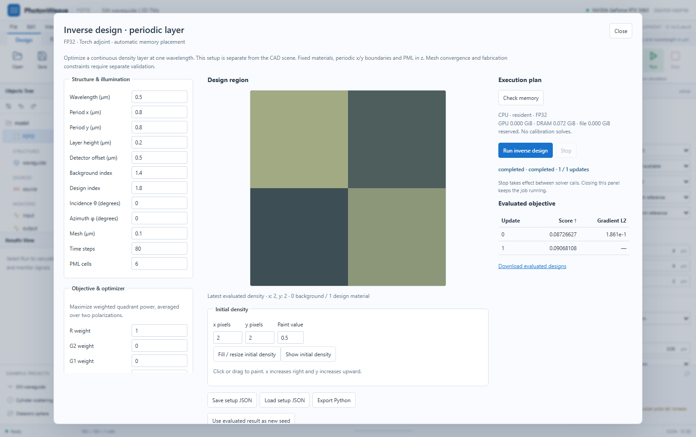

# Periodic density inverse design in the workbench

Open **Inverse design** from the workbench menu. This panel defines a periodic
layer independently of the ordinary CAD scene. It uses the same
`PeriodicLayerResponse` and execution policies available in Python.



Set the wavelength, period, layer height, material indices, incidence, detector
offset, mesh and duration. Paint a density between zero and one, or import a
setup JSON containing `initial_density[x][y]`. The canvas places positive x to
the right and positive y upward. The current API uses fixed lossless indices,
periodic/Bloch x/y boundaries and PML along z. It does not convert arbitrary
CAD objects into a density domain.

The objective is the weighted sum of the R/G2/G1/B detector quadrants, averaged
over two incoherent polarizations at one wavelength. These labels identify
quadrants, not red/green/blue wavelength bands. Positive weights reward power
and negative weights penalize it. Adam updates the real FP32 density and
projects it into [0,1]. The final updated density is evaluated separately,
so the last reported score refers to an actually evaluated design.

**Check memory** creates an admission plan without a field solve or calibration
simulation. Automatic mode prefers resident execution, then DRAM slabs, then
explicitly configured file storage. Other modes fix that choice. The GPU and
DRAM budgets include solver reservations and an allowance for optimizer tensor
state. Python configuration, result lists, runtime overhead and OS cache are
additional. These limits are not exact process-RSS bounds. File backing needs
a directory and budget, with 100 GiB free storage reserved by default.

**Run inverse design** uses the same worker queue as ordinary forward jobs.
Only one job runs at a time in this server instance, with up to two waiting.
An unrelated Python process is outside that queue. Progress includes evaluated
objectives, gradient norms and a density preview, decimated to at most 128 pixels
per axis. Downloads retain the complete density and response.

Stop is checked between forward and backward calls and before optimizer updates.
It cannot interrupt an active solver call. Closing the panel leaves the job
running. Reopening restores the recorded job while the server session remains
available. A cancelled result distinguishes its last evaluated density from
an updated, unevaluated `pending_density`. A failure is shown explicitly.

Save the setup JSON, export a standalone Python script, or download evaluated
designs and scalar history. **Use evaluated result as new seed** starts a new
optimization from that density. It does not restore Adam moments. Persistent
optimizer restart and a multi-wavelength/custom-objective editor are follow-up
work. The separate CR runner retains its own restart interface and objective.

```python
import json
from pathlib import Path
from photonweave import (
    PeriodicDesignConfig, periodic_design_plan, run_periodic_design,
)

config = PeriodicDesignConfig.model_validate_json(
    Path("periodic-design.json").read_text(encoding="utf8")
)
print(periodic_design_plan(config))
result = run_periodic_design(config)
print(result["best"]["objective"])
Path("design-result.json").write_text(json.dumps(result), encoding="utf8")
```

For a different Torch objective, use `PeriodicLayerResponse` directly and write
the loss and optimizer loop in Python. This panel does not restrict that API.

Three focused Python checks cover evaluated-design bookkeeping, cancellation,
field-free admission, schema validation, the shared queue and Python export.
One browser test runs an actual CPU adjoint update through the panel and checks
result download, painting coordinates and exporting the same configuration.
Its two-by-two seed and short duration test the new workflow, not optical
convergence or memory capacity. A later layout check reused the completed job
without repeating its field calculation. No general solver suite was rerun
locally for this addition.
