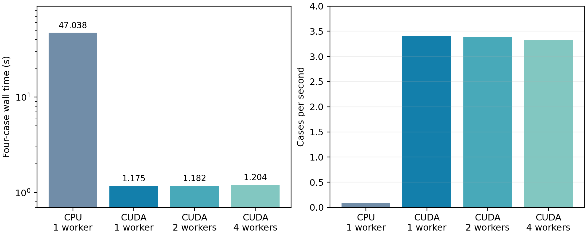

# Independent simulation ensemble validation

Device: NVIDIA RTX 5880 Ada Generation, 48 GB. Native PyTorch 2.10.0 CUDA and
NumPy CPU backends. Benchmark: `benchmarks/batch_validation.py`.

Four independently created dielectric spheres have radii 0.40, 0.45, 0.50 and
0.55 µm. Each uses a 4.8 µm cube, 64³ mesh, physical Yee material sampling,
800 time steps, float32, eight PML cells per face, an electric soft dipole and
one point monitor. No commercial program or program output is used by this
benchmark.

Each resource configuration executes one warm batch and three measured batches.
The median includes voxelization, graph capture, stepping, snapshots, final host
transfers, worker communication and allocator cleanup. Initial process startup is
excluded. A production one-shot batch must also pay startup cost. The CPU baseline
is the same native NumPy implementation, not a compiled commercial solver.

| Resource | Workers | Four-case wall time | Cases/s | Speedup vs NumPy CPU |
| --- | --- | --- | --- | --- |
| CPU | 1 | 47.0377 s | 0.0850 | 1.00x |
| CUDA | 1 | 1.1749 s | 3.4044 | 40.03x |
| CUDA | 2 | 1.1819 s | 3.3845 | 39.80x |
| CUDA | 4 | 1.2040 s | 3.3222 | 39.07x |

**Recommendation for this measured case:** use one worker on this GPU. Additional
concurrent processes do not improve throughput. This result does not rule out
concurrency benefits for other problem sizes, CPU-heavy setup or multiple GPUs.
There is no measured multi-GPU result yet.

The runner supports different meshes, boundaries and materials across cases.
It implements process-level independent simulation concurrency, not fused tensor
batching or MPI decomposition of one grid. CUDA contexts need not execute their
kernels simultaneously. All worker count choices remain explicit.

The [raw report](batch.json) retains per-repeat wall times, case metrics, process
intervals, setup/compute times, hardware and full scene input. It also reports
relative trace-energy differences from the CPU result. Unit tests additionally
compare complete traces and verify overlapping process intervals, persistence,
checksums, cancellation and invalid-objective errors.

Reproduce with `python -m benchmarks.batch_validation`. The calculation takes
several minutes because each CPU repeat solves all four structures. The numbers
are specific to this scene, hardware, software and output policy.
