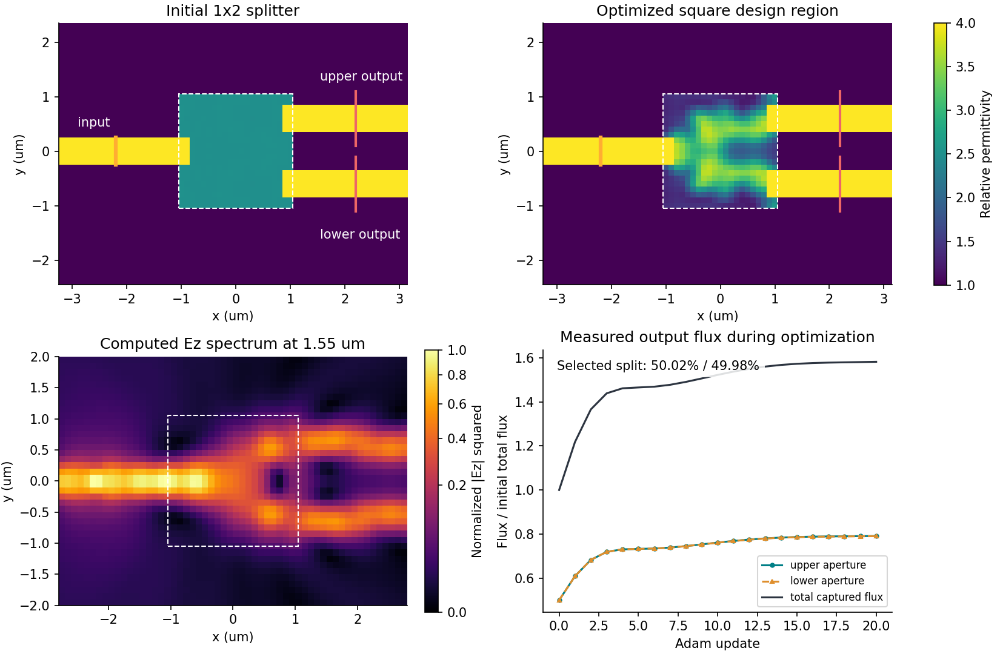

# A 2D 1x2 waveguide splitter

One input waveguide connects to a **2.1 x 2.1 um square design region**, which
connects to two output waveguides. Only the dielectric pattern inside the square
changes. The three guides and their contacts remain fixed.

The public `DifferentiablePlaneSimulation` API computes the discrete Yee/CPML
adjoint of the two output fluxes. PyTorch carries that material gradient through
a density filter and takes an Adam step.

## Run

Install TorchFDTD from PyPI, download `optimize.py` or enter this directory in a
repository checkout, and run:

```sh
pip install torchfdtd
python optimize.py --iterations 20 --check-gradient --output results/splitter
```

The default uses one CPU thread, a 64 x 48 x 1 grid, 320 timesteps, FP64 fields
and four checkpoints. No CUDA device or Node.js is required. The seed is fixed.
The optional gradient check compares one adjoint derivative with a central
finite difference before the optimization starts.

[Conditions and numerical record](../../docs/assets/adjoint-inverse-design.json)
and [`reference.npz`](reference.npz) retain the actual installed-package run.

After 20 Adam updates, the measured aperture split is **50.02% / 49.98%**.
The total captured output flux increases by **1.58x**. One initial adjoint
derivative agrees with a central finite difference to 7.91e-10 relative error.



## Objective and design

The waveguides have refractive index 2 in an index-1 background and width
0.5 um. The two output centers are y = +0.6 and -0.6 um. A soft electric sheet
excites the input guide with a Gaussian pulse centered at 1.55 um. Two equal
x-normal apertures at x = 2.2 um measure the spectral Poynting flux at that
wavelength, one around each output guide.

With upper/lower captured fluxes Pu and Pl, the objective is
`J = 4 Pu Pl / (Pu + Pl)`. At an equal split this equals their total flux.
The optimizer minimizes `-log(J/J0)`, where J0 is the initial value. The best
objective among the prescribed updates is exported.

There are 231 density logits. Sigmoid, vertical mirror symmetry and a 3 x 3
averaging filter give the 21 x 21 design samples, with relative permittivity
between 1 and 4. Short fixed dielectric pads preserve the three guide contacts.
Only the square design region differentiates.

The reported fractions are `Pu/(Pu+Pl)` and `Pl/(Pu+Pl)` for these finite
apertures. They are not incident-normalized device efficiencies or a modal
S-matrix. The design stays continuous, and this coarse CPU tutorial does not
establish mesh convergence, binary fabrication or reproduction of E1/E2/E3.

Outputs:

- `summary.png`: initial/optimized splitter, computed spectral field and output-flux history.
- `design.npz`: density/permittivity arrays, complex Ez map and measured flux history.
- `result.json`: versions, driver hash, geometry, split ratio, objective and gradient check.
- `project.json`: fixed guide/source/monitor setup with the initial uniform design placeholder.
- `optimized_project.json`: a 64-level dielectric CAD approximation and all three guides,
  ready to open in the browser workbench with `torchfdtd serve`.

The [recorded splitter project](splitter.json) can be opened without rerunning
optimization. Its 54 materials and 444 objects fit the default workbench limits.
Quantization changes relative permittivity by at most 0.02379 and the measured
total captured output flux by 0.0174%. The unquantized numerical design remains
in `reference.npz`.

Plots and the CAD export can be regenerated from saved numerical results without
repeating optimization:

```sh
python optimize.py --render-only --output results/splitter
```

For the full-aperture nine-wavelength lens, color hologram and polarization-switched
hologram, see [the paper examples](../full-aperture-tiled-adjoint/).
