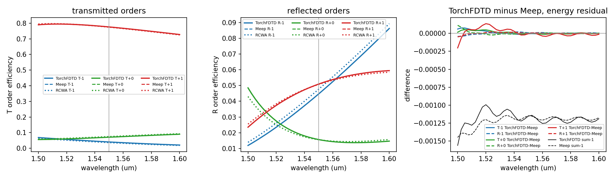

# Metagrating: TorchFDTD against Meep, with an RCWA oracle

A 2D beam-deflecting metagrating: two silicon ridges (n = 3.48) per 2.0 um period on a SiO2
half-space (n = 1.444), E polarised along the ridges (Ez, out of plane), illuminated at normal
incidence from the substrate. At 1.55 um the +1 transmitted order leaves into air at
asin(1.55 / 2.0) = 50.805 degrees. The same `geometry.json` is run in TorchFDTD (RTX 3060, fused
CUDA kernels) and in Meep 1.34.0 (CPU, MPI), both records are decomposed into diffraction orders
by one Fourier routine in `compare.py`, and TORCWA 0.1.4.2 (rigorous coupled-wave analysis,
Kim and Lee, Comput. Phys. Commun. 282, 108552 (2023)) supplies a third, grid-free answer.



## Fixture (`geometry.json`)

| quantity | value |
|---|---|
| period | 2.0 um, 100 cells of 0.02 um, periodic in x |
| cell | 2.0 x 3.64 um, 100 x 182 cells = 18,200 cells |
| substrate | SiO2 n = 1.444, top surface at y = 0.01 um |
| ridges | Si n = 3.48, height 0.5 um; ridge 1 centre -0.93 um width 0.08 um (Ez columns 2-5); ridge 2 centre -0.32 um width 0.22 um (columns 29-39); rows 92-116 |
| absorber | 20 cells (0.4 um) at both y faces |
| time step | Courant 0.99 / sqrt(2) = 0.700036, dt = 4.670136e-17 s, 12,000 steps (560 fs) |
| source | Ez current sheet across the period at y = -1.22 um (row 30), Gaussian pulse: sigma = 3 cycles at 1.55 um, offset 4 sigma, sin(omega t) |
| DFT lines | y = -0.81 um (reflection, in the substrate) and y = 1.01 um (transmission, in air), 100 samples at the pixel centres x = -0.99 + 0.02 i |
| spectrum | 41 wavelengths uniformly spaced from 1.50 to 1.60 um; 1.55 um is sample 20 |
| orders | -1, 0, +1 propagate in both media over the whole band; |m| >= 2 is evanescent (2 lambda / (n Lambda) > 1 for lambda >= 1.444 um) |

Design step (TorchFDTD only, not part of the comparison, `design.py` and `design.json`): a
coarse parametric sweep of two ridge widths (4 to 40 Ez nodes in steps of 4) and their gap
(4 to 40 nodes in steps of 4), then a refinement of +-3 nodes in steps of 1 around the best
point, 809 evaluations in 275 s at 8,000 steps and one wavelength, objective = +1 transmitted
order efficiency at 1.55 um from the same decomposition as `compare.py`. Best: widths 4 and 11
nodes, gap 23 nodes, T+1 = 0.7763 (8,000 steps, 181-row cell). Mirror images score the -1
order; the winner is oriented so that +1 is the strong order.

## Fairness

- Both scripts load `geometry.json` and record its SHA-256; `compare.py` checks that the two
  records agree on cells, dt (1e-9 relative), steps, PML cells, hash, the silicon staircase
  (Ez columns and rows read back from each solver's own permittivity array) and the DFT sample
  positions (1e-9 um).
- Yee grid alignment: Meep places its Ez nodes at even multiples of the mesh from the cell
  centre, so its node grid coincides with TorchFDTD's only when each axis has an even cell
  count. With 181 rows (substrate top at y = 0) the two node grids were offset by half a cell
  in y, every material edge became a tie on one solver, and the +1 order differed by 0.037.
  The cell therefore has 182 rows and every material edge sits midway between nodes; with that
  the two staircases are identical and the +1 order agrees to 2e-4.
- Same pulse: the TorchFDTD script asserts its native waveform equals the shared function
  (max difference 0.0); the Meep script feeds the same function to a `CustomSource`
  (`is_integrated=False`). Amplitude conventions differ, so every efficiency is a ratio to the
  forward incident power of a bare-substrate reference run of the same solver.
- Same DFT lines, same 41 frequencies, no apodization; both solvers report Ez and Hx at the
  pixel centres (Ez interpolated from the same four nodes, Hx from the same two).
- Same material sampling: Meep `eps_averaging=False`, TorchFDTD staircase with per-component
  (Yee) sampling.
- Differences that remain: TorchFDTD steps in float32 (DFT accumulation in float64), Meep in
  float64; TorchFDTD uses CPML with a cubic sigma profile, Meep its own stretched-coordinate
  PML with a quadratic profile, only the thickness (20 cells) is identical; Meep runs on CPU
  ranks, TorchFDTD on the GPU.
- Decomposition (`compare.py`, applied identically to both records): order amplitudes are the
  spatial Fourier means of Ez and Hx over the period; the forward and backward branches are
  e+- = (e +- (k0 / ky) h) / 2 and the branch power is 0.5 (ky / k0) |e+-|^2. Both solvers
  use exp(+i omega t) in the DFT (checked with an outgoing wave: d(arg Ez)/dx = +4.0542 per um in
  TorchFDTD and +4.0545 per um in Meep against k0 = 4.0537 per um). Reference-run checks recorded with the comparison:
  bare-substrate T0 and R0 differ from the Fresnel values (0.96700, 0.03300) by at most
  4.6e-4 in both solvers, the +-1 order power in the reference is below 1e-31 of the incident
  power, and the backward branch at the transmission line is below 1.9e-7.
- RCWA: input layer SiO2, one patterned layer, output layer air, s polarisation, permittivity on
  a 20,000-cell real-space grid whose cell boundaries coincide with the ridge edges, Toeplitz
  matrix from the FFT (Laurent rule; E is parallel to the ridges). Harmonic sweep at 1.55 um,
  largest change of any of the six efficiencies from the previous count: 10 harmonics 3.2e-2,
  15: 6.2e-3, 20: 1.3e-3, 30: 1.1e-4, 40: 1.7e-4, 60: 4.3e-5, 80: 1.6e-5, 120: 8.9e-6; the band
  uses 120 harmonics (241 orders), sum of the six orders 1 - 9.6e-13, s-p and xy bases equal.

## Criteria (`criteria.json`, declared before the first comparison)

| criterion | measured (max over band) | limit | where | result |
|---|---|---|---|---|
| `torchfdtd_vs_meep_order_efficiency` | 0.00020 | 0.01 | 1.5 um T+1 | pass |
| `torchfdtd_vs_rcwa_order_efficiency` | 0.00553 | 0.02 | 1.5 um R+0 | pass |
| `meep_vs_rcwa_order_efficiency` | 0.00541 | 0.02 | 1.5 um R+0 | pass |
| `torchfdtd_energy_balance` | 0.00156 | 0.01 | 1.5 um | pass |
| `meep_energy_balance` | 0.00145 | 0.01 | 1.5 um | pass |

At 1.55 um the largest TorchFDTD-Meep difference is 7.3e-6. Both FDTD records fall short of
unit energy by 1.1e-3 at 1.55 um. The pixel-centre sampling of the DFT lines averages
neighbouring Ez nodes and scales the +-1 orders by cos^2(pi dx / Lambda) = 0.99901 in both
solvers, 0.9e-3 of the 1.1e-3; the interpolation between rows, the Yee dispersion entering the
E/H branch split and the finite run time make up the rest and are not separated here. The
FDTD-RCWA differences of up to 5.5e-3 are the shared 0.02 um staircase and Yee dispersion
(identical in the two FDTD records) against the Fourier-series geometry of RCWA.

## Table produced by `compare.py`

| quantity | TorchFDTD | Meep | RCWA | TorchFDTD-Meep | TorchFDTD-RCWA | Meep-RCWA |
|---|---|---|---|---|---|---|
| T-1 at 1.55 um | 0.0405 | 0.0405 | 0.0365 | -0.0000 | +0.0041 | +0.0041 |
| T+0 at 1.55 um | 0.0710 | 0.0710 | 0.0750 | -0.0000 | -0.0040 | -0.0040 |
| T+1 at 1.55 um | 0.7761 | 0.7761 | 0.7746 | -0.0000 | +0.0015 | +0.0015 |
| R-1 at 1.55 um | 0.0446 | 0.0446 | 0.0476 | +0.0000 | -0.0030 | -0.0030 |
| R+0 at 1.55 um | 0.0157 | 0.0157 | 0.0156 | +0.0000 | +0.0001 | +0.0001 |
| R+1 at 1.55 um | 0.0509 | 0.0509 | 0.0507 | -0.0000 | +0.0002 | +0.0002 |
| sum of orders, torchfdtd | 0.9988 at 1.55 um | band min 0.9984 | band max 0.9990 | | | |
| sum of orders, meep | 0.9989 at 1.55 um | band min 0.9986 | band max 0.9989 | | | |
| sum of orders, rcwa | 1.0000 at 1.55 um | band min 1.0000 | band max 1.0000 | | | |

## Timing

Development records only (`timing_mode: development`, one run each, shared host: host CPU
45-62 %, GPU utilisation 9-11 % from other jobs before the runs). Grating run, 18,200 cells,
12,000 steps:

| solver | setup s | stepping s | full s |
|---|---|---|---|
| TorchFDTD, RTX 3060, fused CUDA kernels, CUDA graph, float32 | 0.030 | 0.260 | 0.308 |
| Meep 1.34.0, 4 MPI ranks, float64 | 0.005 | 1.491 | 1.496 |

The cell is 18,200 cells; kernel launch and MPI synchronisation overheads dominate at this size,
so these numbers do not measure throughput and no throughput conclusion is drawn from them.
The 12-rank `--timing` run (one warm-up, three timed solves) is launched by the maintainer on a
quiet host; its samples replace the table above.

## Running

From the worktree root inside the WSL distribution `torchfdtd-bench` (TorchFDTD venv and Meep
micromamba environment), and from Windows for the RCWA oracle:

```bash
PYTHONPATH=$PWD python examples/meep_comparison/metagrating/torchfdtd_metagrating.py --out docs/validation/meep_comparison/metagrating_torchfdtd.json
OMP_NUM_THREADS=1 mpirun -np 4 python examples/meep_comparison/metagrating/meep_metagrating.py --ranks 4 --out docs/validation/meep_comparison/metagrating_meep.json
python examples/meep_comparison/metagrating/compare.py
```

Add `--timing` to the two solver commands for the timed records (`--ranks 12` with
`mpirun -np 12` for Meep). The RCWA record is regenerated with
`C:\anaconda3\python.exe examples/meep_comparison/metagrating/rcwa_metagrating.py --out docs/validation/meep_comparison/metagrating_rcwa.json`
(TORCWA 0.1.4.2, torch 2.6.0+cu118, complex128 on CUDA, 114 s for the sweep and the band).
`compare.py` reads the three records, writes `metagrating_comparison.json` and renders the
figure; `tests/test_meep_comparison_metagrating.py` reproduces the comparison JSON and this
README's tables from the committed records without running any solver.

## Deviations from the brief

- The DFT lines sit at pixel centres (y = -0.81 and 1.01 um) rather than on Ez rows, so that
  both solvers interpolate identically (Meep's `add_dft_fields` returns the centred grid).
- The cell has 182 rows and the substrate top is at y = 0.01 um (see Yee grid alignment above).
- The comparison uses 12,000 steps; the design sweep used 8,000. In a TorchFDTD development
  check on the 181-row cell the six efficiencies changed by at most 8.8e-4 between 8,000 and
  16,000 steps, and the final-snapshot field maximum fell from 9.6e-3 to 1.6e-4 (reduced units).
- The Meep staircase is read from the permittivity Meep stores for Ez
  (`fields.get_chi1inv` at the nodes), not from `get_epsilon_point`, which returns an average
  over the neighbouring E-component locations.
- TorchFDTD's `diffraction_orders` requires a 3D plane; the decomposition is written in
  `compare.py` and applied to both records, as the brief allows.
