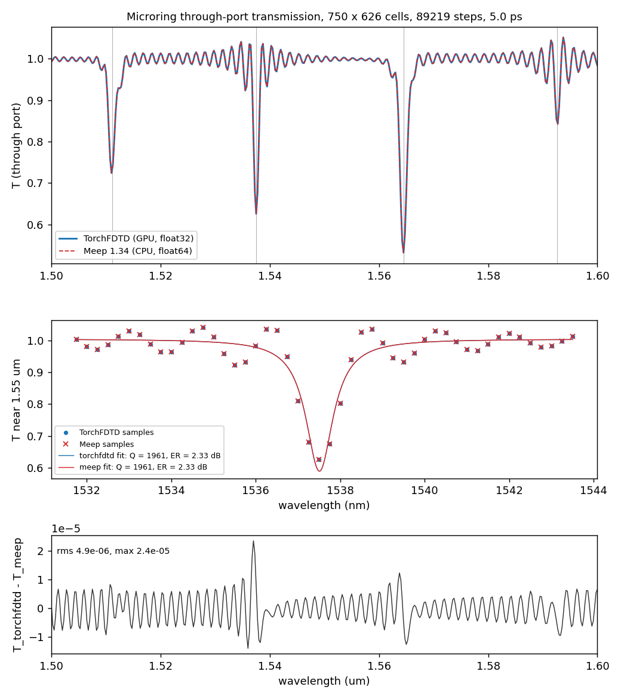

# Microring resonator: TorchFDTD versus Meep

A 2D microring resonator side-coupled to a straight bus waveguide, out-of-plane E field
(Ez; the polarisation Meep calls TM in 2D). Both solvers run the same device from
[`geometry.json`](geometry.json) on the same workstation; [`compare.py`](compare.py) reads the
two records and produces the tables below and
[`docs/figures/meep_comparison/microring.png`](../../../docs/figures/meep_comparison/microring.png).



## Device and fixture

| Item | Value |
|---|---|
| Background | SiO2, n = 1.444 |
| Core | n = 2.83, the 2D effective index of a 220 nm SOI TE slab as in the Meep ring tutorials |
| Bus waveguide | width 0.5 um, centre y = -5.304 um, spanning the cell in x |
| Ring | outer radius 5.0 um, width 0.5 um (inner radius 4.5 um), centre (0, 0) |
| Gap between bus and ring | 0.054 um (see "Gap" below) |
| Mesh | 24 nm uniform, 750 x 626 cells (18.0 x 15.024 um), 22.08 cells per wavelength in the core at 1.5 um |
| Time step | Courant number 0.99/sqrt(2) = 0.70004, dt = 5.6042e-17 s, 89219 steps = 5.0 ps |
| Absorber | 42 cells = 1.008 um on all four sides (TorchFDTD CPML, Meep PML) |
| Source | one Gaussian pulse, centre 1.55 um, sigma = 4 cycles (20.7 fs), envelope centred at 4 sigma, `amplitude*exp(-0.5*((t-4*sigma)/sigma)^2)*sin(2*pi*f0*t)`; additive Ez line at x = -7.512 um across the bus, 63 rows (rows 61 to 123, the two end rows at weight 0.5) |
| Flux monitors | x-normal planes across the bus at x = -6.0 um (column 125) and x = +6.0 um (column 625), 83 rows (rows 51 to 133), 401 wavelength samples from 1.50 to 1.60 um, DFT over the whole run without apodization |
| Normalisation | T(lambda) = out-plane flux of the ring run / out-plane flux of a straight-bus run of the same solver |

The pulse covers the band: at the band edges (187.4 and 199.9 THz) its spectral amplitude is
0.72 of the peak.

### Gap

The brief asked for a gap between 0.15 and 0.2 um chosen so that the loaded Q of the resonance
nearest 1.55 um lies between 500 and 2000, resolved in a 3 to 5 ps run. A TorchFDTD ring-down
sweep (point probe in the ring, energy decay of the windowed RMS field, 4 ps development runs
made before the comparison) gave the following loaded Q at this fixture:

| Gap (um) | 0.19 | 0.15 | 0.11 | 0.07 | 0.054 | 0.03 |
|---|---|---|---|---|---|---|
| Loaded Q from the ring-down | above 1e5 | 9.9e3 | 3.5e3 | 1.5e3 | 950 | 610 |

(20 nm mesh for the gaps from 0.07 to 0.19 um, the 24 nm mesh of the fixture for 0.03 and 0.054 um.)

A 5 um ring at this index contrast has no measurable bend loss, so the loaded Q is set by the
coupler alone, and a gap in the requested range gives Q of 1e4 or more: the amplitude e-fold time
Q*lambda/(pi*c) is then 16 ps or longer, and no 3 to 5 ps window resolves the dip. The gap was
therefore moved to 0.054 um, the largest gap on the node lattice whose Q lies inside the window
(the bus centre must sit on an Ez node, so the gap is quantised in 0.024 um steps). The 5 ps run
is 3.2 amplitude e-fold times of a Q = 950 decay (field residual 4 percent at the end of the
window) and is the longest run below TorchFDTD's 100000-step limit at this mesh. The ring-down
figures in the table are broadband energy-decay estimates of the pulse-excited ring, dominated
by the lowest-Q orders in the band; the per-resonance Lorentzian fits of the comparison give
1174 to 2812 at gap 0.054 um, window-broadened (see "Reading the tables"). The alternative
deviation, a smaller ring at the requested gap, was also measured: R = 2.5 um, gap 0.154 um gives
Q = 1090 but a 1 dB dip (the bend loss, Q_i about 1100, cannot be matched by the coupling, Q_c
about 2e4) and one resonance in the band, so it was not used.

Consequences of the strong coupling that are visible in the records: the through-port
extinction is 0.9 to 3.0 dB (the ring is overcoupled; the dips come from the coupler's
scattering loss, not from bend loss), the in-plane flux drops by up to 31 percent at resonance
(light returned to the bus region by the ring), and the truncation of the 5 ps window leaves a
ripple of period about 1.7 nm on T with sidelobes next to each dip. Both solvers see the same
discretised device and reproduce all of it (see the tables).

### Fairness statement

Identical in both scripts, and proven by the records:

- the geometry from one `geometry.json` (sha256 recorded in both records and checked by the test);
- the Yee grid: 750 x 626 Ez nodes at x_i = i*dx - 9.0, y_j = j*dx - 7.512, dt, Courant number and
  step count asserted to 1e-12 relative in both scripts and 1e-9 in `compare.py`;
- the staircase permittivity at every interior Ez node (TorchFDTD `material_sampling="yee"`
  staircase, Meep `eps_averaging=False`): both records hash the same 665 x 541 interior array to
  `b937c9bfeae3...` with 39853 core nodes. No Ez node lies exactly on either circle (closest
  4.5e-5 um) or on a bus edge, so the two solvers' different treatment of boundary nodes never
  applies. The Meep script also checks 2000 random interior nodes against the permittivity the
  solver holds (`chi1inv`);
- the source: the same sampled pulse (sha256 of the sampled waveform in both records), on the same
  63 Ez nodes with the same weights. Meep restricts a line ending on nodes to weight 1 inside and
  0.5 on the end rows; TorchFDTD reproduces this with a 61-node plane source plus two point sources
  of amplitude 0.5. Meep injects a current (E += -dt J/eps) while TorchFDTD adds the pulse to E, so
  the Meep source carries `amp_func` = node permittivity and both solvers apply the same E
  increment on the 21 core rows and the 42 cladding rows. The overall amplitude and the
  time-step convention still differ and cancel in the ratio T;
- the monitors: the same Ez node columns, the same 83 rows, the same 401 frequencies, DFT over
  the same 89219 steps, no window;
- no symmetry planes, no subpixel averaging, no coarse-then-fine.

Different, by construction of the two codes:

- absorber: TorchFDTD CPML (cubic sigma profile, kappa = 1, alpha = 1e-8) versus Meep's
  stretched-coordinate PML (quadratic profile, R_asymptotic = 1e-15); only the thickness (42 cells)
  is identical;
- precision: TorchFDTD steps in float32 on the GPU (fused CUDA kernel, CUDA graph) with float64
  DFT accumulators; Meep steps in float64 on the CPU;
- flux quadrature: TorchFDTD interpolates E and H to the midpoints of the cells spanning the
  plane (trilinear Yee interpolation, H phase advanced by half a step); Meep integrates over the
  Ez nodes of the plane with its restriction weights at the two ends. Both cancel in the ratio T
  for the guided mode.

## Running it

From the repository root, with `python` resolving to an environment that has torchfdtd with CUDA
PyTorch and CuPy for the first command, and to the Meep environment (a conda-forge `pymeep=*=mpi*`
install) for the second (the record was taken in a WSL2 Ubuntu distribution on the Windows host):

```bash
# 1. TorchFDTD on the GPU (20 to 40 s per run on a shared RTX 3060, two runs)
PYTHONPATH=$PWD python examples/meep_comparison/microring/torchfdtd_microring.py

# 2. Meep on the CPU, 4 MPI ranks (100 to 220 s per run on the shared host, two runs)
OMP_NUM_THREADS=1 \
    mpirun -np 4 python examples/meep_comparison/microring/meep_microring.py --ranks 4

# 3. Compare the two records, write the comparison JSON, print the tables, render the figure
python examples/meep_comparison/microring/compare.py
```

Both simulation scripts take `--out <path>` and `--timing` (one warm-up solve, then three timed
solves; the record then says `timing_mode: timing`). The committed records are development runs
(`timing_mode: development`, one sample each) made on a shared workstation; the 12-rank timing
is the maintainer's. The TorchFDTD script asserts that it imports `torchfdtd` from this
repository. `compare.py` needs numpy, scipy and matplotlib and runs anywhere (it reads records
only). Records: `docs/validation/meep_comparison/microring_torchfdtd.json`,
`microring_meep.json`, `microring_comparison.json`.

## Results

Criteria were declared in [`criteria.json`](criteria.json) before the first comparison run:
resonance wavelengths within 0.2 nm, loaded Q within 5 percent relative, extinction within 1 dB,
RMS difference of T over the band at most 0.02, and equal grid facts. The tables below are the
output of `compare.py` on the committed records (a test regenerates them).

| Quantity | TorchFDTD | Meep | Difference | Criterion | Result |
|---|---|---|---|---|---|
| Resonances found in 1.50-1.60 um | 8 | 8 | same count | same count | pass |
| Minimum 1 (nm), Lorentzian centre | 1511.085 | 1511.085 | 0.0000 | <= 0.2 | pass |
| Minimum 2 (nm), parabolic minimum, no Lorentzian width (truncation sidelobe) | 1535.573 | 1535.573 | 0.0001 | <= 0.2 | pass |
| Minimum 3 (nm), Lorentzian centre | 1537.508 | 1537.508 | 0.0000 | <= 0.2 | pass |
| Minimum 4 (nm), parabolic minimum, no Lorentzian width (truncation sidelobe) | 1539.452 | 1539.452 | 0.0000 | <= 0.2 | pass |
| Minimum 5 (nm), Lorentzian centre | 1564.481 | 1564.481 | 0.0000 | <= 0.2 | pass |
| Minimum 6 (nm), parabolic minimum, no Lorentzian width (truncation sidelobe) | 1590.665 | 1590.665 | 0.0000 | <= 0.2 | pass |
| Minimum 7 (nm), Lorentzian centre | 1592.660 | 1592.660 | 0.0000 | <= 0.2 | pass |
| Minimum 8 (nm), parabolic minimum, no Lorentzian width (truncation sidelobe) | 1594.713 | 1594.713 | 0.0000 | <= 0.2 | pass |
| Free spectral range (nm), minima with a valid fit | 27.19 | 27.19 | 0.0000 | reported | - |
| Nearest-1.55 um resonance centre (nm) | 1537.508 | 1537.508 | 0.0000 | <= 0.2 | pass |
| Loaded Q (Lorentzian fit) | 1960.9 | 1960.9 | 0.001 % | <= 5 % | pass |
| Extinction ratio (dB) | 2.325 | 2.325 | 0.0001 | <= 1.0 | pass |
| Full width at half depth (nm) | 0.784 | 0.784 | 0.0000 | reported | - |
| Fit depth | 0.417 | 0.417 | 0.0000 | reported | - |
| Fit residual, RMS of T over the +-4 nm fit window | 0.0413 | 0.0413 | 1.10e-06 | reported | - |
| RMS of T_torchfdtd - T_meep over 401 samples | - | - | 4.87e-06 | <= 0.02 | pass |
| Max abs T difference | - | - | 2.35e-05 | reported | - |
| Grid, dt, steps, PML, geometry and staircase hash | b937c9bfeae3 | b937c9bfeae3 | - | equal | pass |

| Lorentzian fits (minima with a valid fit) | Centre TorchFDTD (nm) | Centre Meep (nm) | Q TorchFDTD | Q Meep | ER TorchFDTD (dB) | ER Meep (dB) | FWHM TorchFDTD (nm) | FWHM Meep (nm) | Fit RMS TorchFDTD | Fit RMS Meep |
|---|---|---|---|---|---|---|---|---|---|---|
| Minimum 1 | 1511.085 | 1511.085 | 1198.2 | 1198.3 | 1.482 | 1.482 | 1.261 | 1.261 | 0.0160 | 0.0160 |
| Minimum 3 | 1537.508 | 1537.508 | 1960.9 | 1960.9 | 2.325 | 2.325 | 0.784 | 0.784 | 0.0413 | 0.0413 |
| Minimum 5 | 1564.481 | 1564.481 | 1173.9 | 1173.9 | 3.034 | 3.034 | 1.333 | 1.333 | 0.0174 | 0.0174 |
| Minimum 7 | 1592.660 | 1592.660 | 2811.5 | 2811.6 | 0.885 | 0.885 | 0.566 | 0.566 | 0.0333 | 0.0333 |

| Timing (ring run) | TorchFDTD (RTX 3060, float32) | Meep (CPU, float64, 4 ranks) |
|---|---|---|
| Cells x steps | 750 x 626 = 469500 cells, 89219 steps | same |
| Stepping (s) | 31.36 | 217.05 |
| Full solve (s) | 35.10 | 217.11 |
| Straight-bus run, stepping (s) | 41.26 | 180.81 |
| Timing mode | development (1 sample) | development (1 sample) |
| Load note | development run on a shared workstation: other GPU and CPU jobs may have been running; WSL load average before [2.70703125, 3.4658203125, 3.20654296875], after [1.447265625, 2.88232421875, 3.0205078125]; GPU memory used before the run 2737.0 MiB, GPU utilisation before the run 8.0 %. | development run with 4 MPI ranks on a shared workstation (20 logical CPUs; other jobs may have been running); WSL load average before [2.9169921875, 3.0263671875, 2.87890625], after [4.0, 3.76171875, 3.29150390625]. |

Reading the tables:

- The declared detection (local minima of T below 0.95 with prominence above 0.03) returns the
  four resonances (minima 1, 3, 5, 7) and, identically in both records, the first truncation
  sidelobe on either side of the 1537.5 nm and 1592.7 nm resonances (minima 2, 4, 6, 8). The
  sidelobes have no Lorentzian width; they are located by the parabola through their three
  samples and counted in the wavelength criterion. The free spectral range (27.19 nm) and the
  nearest-1.55 um resonance use the minima with a valid fit. This handling is recorded as a note
  in `criteria.json`; the thresholds and limits were not changed.
- The resonance nearest 1.55 um is the one at 1537.508 nm (12.5 nm away; the 1564.481 nm one is
  14.5 nm away). Its fitted Q of 1961 corresponds to an amplitude e-fold time of 3.2 ps, so the
  5 ps window truncates its ring-down at 1.5 e-folds. Truncation broadens the line: the power
  spectrum of exp(-g t) cut at g t = 1.5 has 1.98 times the full width of the untruncated
  Lorentzian (1.33 times at g t = 2.5, 1.01 times at g t = 5), so the fitted Q of 1961 is a lower
  bound and the loaded Q of this resonance is of order 2 x 1961. The same holds for the 1592.7 nm
  order (fitted Q 2812, 1.1 e-folds in the window) and, less strongly, for the 1511.1 nm and
  1564.5 nm orders (fitted Q 1198 and 1174, 2.5 e-folds in the window). The requested loaded-Q
  window of 500 to 2000 is therefore not demonstrated for this fixture: the fitted Q of the
  nearest-1.55 um resonance (1961) lies inside it only because the window broadens the line,
  and the 1592.7 nm order fits outside it. The ring-down estimate of 950 that set the gap is a
  broadband energy-decay figure of the pulse-excited ring, dominated by the lowest-Q orders in
  the band, and is not the Q of any single resonance. The fit residual of the 1537.5 nm fit
  (RMS 0.041, 10 percent of the fitted depth 0.417) is larger than that of the 1511.1 nm and
  1564.5 nm fits (0.016 and 0.017) because the +-4 nm fit window contains the truncation
  sidelobes at 1535.6 and 1539.5 nm, which the Lorentzian does not describe. All of this is
  identical in the two solvers, which is what the comparison measures; the fixture question is
  recorded as a dated note in `criteria.json` and the test asserts the solver-agreement criteria
  only.
- The largest difference between the two spectra is 2.4e-5 in T, at the steep flank of the
  1537.5 nm dip; the difference away from the dips oscillates with the window ripple at the
  1e-5 level (float32 stepping versus float64, and the two absorbers).

## Timing

The times in the table are development-mode single samples on a shared workstation (i7-12700,
20 logical CPUs in WSL2, RTX 3060 12 GB) while other agents' jobs were running on the same CPU
and GPU; the load notes are copied from the records. The same two scripts, run three times during
the development of this example, gave TorchFDTD stepping times of 20.8, 25.6 and 31.4 s and Meep
stepping times of 98.2, 99.7 and 217.1 s for the ring run (only the last pair is in the records),
so the numbers carry the host load of their moment: the WSL load average was 2.7 to 4.0 during
the recorded runs and the GPU had been at 98 percent utilisation from another job minutes before
the TorchFDTD run. The TorchFDTD stepping time excludes voxelisation, grid and graph construction
and the final host copy, which the full-solve time includes. Meep's stepping time is `sim.run`
alone; its full time adds `Simulation` construction, `init_sim` and `get_fluxes`. The 12-rank
timing with `--timing` on a quiet host is not part of these records.

## Deviations from the shared brief

1. Gap 0.054 um instead of 0.15 to 0.2 um, for the reason given under "Gap": the requested gap
   range and the requested Q window cannot both hold for this ring. The Q window of 500 to 2000 is
   not demonstrated at 0.054 um either: the fitted Q of the resonance nearest 1.55 um (1961) is a
   lower bound broadened by the 5 ps window, and the 1592.7 nm order fits to 2812.
2. Absorber 1.008 um (42 cells) instead of 1.0 um: the thickness must be a whole number of
   24 nm cells.
3. The declared resonance detection also returns truncation sidelobes; they are kept and marked
   rather than re-declaring the detection after seeing the data.
